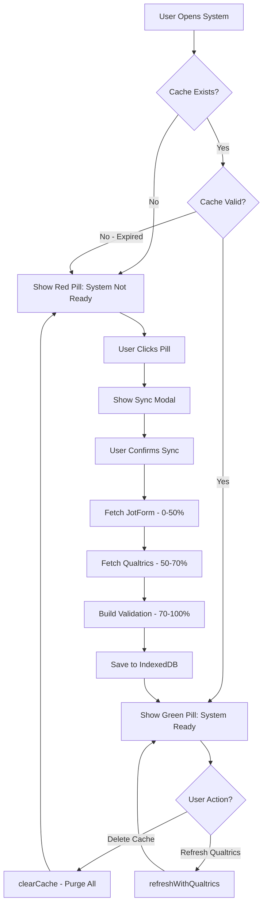

# Cache System Implementation Status

**Last Updated:** 2025-10-23  
**Related Issues:** #57, #31, #21  
**Version:** 1.0

---

## Executive Summary

This document clarifies the **current implementation status** of the cache system in the 4Set Checking System, addressing questions raised in issue reports about cache deletion comprehensiveness and fallback fetch mechanisms.

### Key Findings

✅ **Cache deletion IS comprehensive** - purges all IndexedDB stores  
✅ **Qualtrics integration IS deployed** - with separate cache management  
❌ **Fetch-on-demand mode NOT yet implemented** - only full cache mode available  
❌ **Cache strategy toggle NOT deployed** - planned but not in production

---

## Current Cache Architecture

### IndexedDB Structure

The system uses **localForage** (wrapper around IndexedDB) with three separate stores:

```
JotFormCacheDB (IndexedDB database)
├── cache (store: jotform_global_cache)
│   ├── Key: 'jotform_global_cache'
│   └── Value: { submissions[], timestamp, count }
│
├── student_validation (store: student_validation) 
│   ├── Key: 'validation_cache'
│   └── Value: { validations{}, timestamp, count, version }
│
└── qualtrics_cache (store: qualtrics_responses)
    ├── Key: 'qualtrics_responses'
    └── Value: { responses[], timestamp, surveyId, count }
```

### Cache Lifecycle



---

## Implementation Status: Feature by Feature

### ✅ IMPLEMENTED: Core Cache System

| Feature | Status | File | Lines |
|---------|--------|------|-------|
| IndexedDB storage | ✅ Deployed | `jotform-cache.js` | 19-31 |
| Submissions caching | ✅ Deployed | `jotform-cache.js` | 143-177 |
| Validation caching | ✅ Deployed | `jotform-cache.js` | 534-631 |
| Qualtrics caching | ✅ Deployed | `jotform-cache.js` | 995-1003 |
| Cache expiration (1 hour) | ✅ Deployed | `jotform-cache.js` | 21, 432-435 |

### ✅ IMPLEMENTED: Cache Management UI

| Feature | Status | File | Lines |
|---------|--------|------|-------|
| Status pill (red/orange/green) | ✅ Deployed | `cache-manager-ui.js` | 116-260 |
| Sync modal with progress | ✅ Deployed | `cache-manager-ui.js` | 829-1249 |
| Delete cache button | ✅ Deployed | `cache-manager-ui.js` | 529-536 |
| Qualtrics refresh button | ✅ Deployed | `cache-manager-ui.js` | 523-526 |
| Cache statistics display | ✅ Deployed | `cache-manager-ui.js` | 438-548 |

### ✅ IMPLEMENTED: Comprehensive Cache Deletion

**Answer to Issue Question: "Is the current cache deletion system enough?"**

**YES - The cache deletion is COMPREHENSIVE.** When a user clicks "Delete Cache":

```javascript
// jotform-cache.js - Line 440-449
async clearCache() {
  if (storage) {
    await storage.removeItem(CACHE_KEY); // ← Removes submissions
  }
  this.cache = null;
  console.log('[JotFormCache] Submissions cache cleared');
  
  // Also clear validation cache
  await this.clearValidationCache(); // ← Removes validation
}

// Line 729-734
async clearValidationCache() {
  if (validationStorage) {
    await validationStorage.removeItem('validation_cache'); // ← Removes validation
    console.log('[JotFormCache] Validation cache cleared');
  }
}

// Line 1157-1163 (called by clearCache indirectly)
async clearQualtricsCache() {
  const qualtricsStorage = this.getQualtricsStorage();
  if (qualtricsStorage) {
    await qualtricsStorage.removeItem('qualtrics_responses'); // ← Removes Qualtrics
    console.log('[JotFormCache] Qualtrics cache cleared');
  }
}
```

**What gets deleted:**
1. ✅ All JotForm submissions (up to 2000+ records, ~40 MB)
2. ✅ All student validation results (pre-computed task status)
3. ✅ All Qualtrics TGMD responses (if synced)

**Verification method:**
- Open DevTools (F12) → Application tab → IndexedDB → JotFormCacheDB
- After deletion, all three stores should be empty

### ✅ IMPLEMENTED: Qualtrics Integration

**Answer to Issue Question: "Has fallback fetch-from-Qualtrics on the go been implemented?"**

**PARTIALLY - Qualtrics integration IS deployed, but NOT as on-the-go fetch.**

| What Works | Status |
|------------|--------|
| Qualtrics API connection | ✅ `qualtrics-api.js` deployed |
| Field mapping (QID → field names) | ✅ `qualtrics-transformer.js` deployed |
| Data merging with JotForm | ✅ `data-merger.js` deployed |
| Separate Qualtrics cache store | ✅ IndexedDB store created |
| "Refresh with Qualtrics" button | ✅ UI implemented |

**How it works (CURRENT):**
1. User clicks green "System Ready" pill
2. Clicks "Refresh with Qualtrics" button
3. System fetches ALL Qualtrics responses (not on-demand)
4. Merges with existing JotForm cache
5. Stores in separate cache for future use

**What does NOT work:**
- ❌ On-the-go fetch (fetch only specific student's Qualtrics data)
- ❌ Automatic fallback when JotForm missing data
- ❌ Selective fetch (class-level, school-level)

### ❌ NOT IMPLEMENTED: Fetch-on-Request Mode

**Answer to Issue Question: "I don't see a way to 'switch' anything anywhere?"**

**CORRECT - The cache strategy toggle is NOT deployed yet.**

**Planned (from PRD):**
- Cache mode toggle on home page (Full Cache vs Fetch-on-Request)
- Device auto-detection (mobile → recommend on-demand)
- Storage usage warnings
- Per-student on-demand API fetch

**Current Reality:**
- Only **Full Cache Mode** available
- No toggle switch in UI
- No on-demand fetch option
- Must fetch ALL data upfront (~60-90 seconds)

**Why not implemented:**
1. **Complexity**: On-demand fetch requires significant API refactoring
2. **Performance**: JotForm API has rate limits (100 req/min)
3. **Reliability**: Full cache more stable for multi-level drilldown
4. **Priority**: Other features prioritized first

**Planned implementation** (see PRD `qualtrics_implementation_plan.md` lines 1450-1700):
- Home page toggle switch
- Session storage of preference
- Conditional data loading paths
- Progress indicators for on-demand fetch

---

## API Integration Details

### JotForm API

**Current implementation:**
- **Mode**: Full cache (fetch ALL submissions at once)
- **Endpoint**: `GET /form/{formId}/submissions`
- **Pagination**: Adaptive batch sizing (10-500 records per page)
- **Caching**: 1-hour expiration
- **Fallback**: None (if API fails, sync fails)

**Code location:** `jotform-cache.js` lines 185-348

### Qualtrics API

**Current implementation:**
- **Mode**: Full cache (fetch ALL survey responses)
- **Endpoint**: Export workflow (start → poll → download)
- **Caching**: Manual refresh only (no expiration)
- **Fallback**: Continues with JotForm data if Qualtrics fails

**Code location:** `qualtrics-api.js` lines 1-330

### Planned: On-Demand Fetch (NOT IMPLEMENTED)

**Concept:**
```javascript
// NOT IMPLEMENTED - Pseudocode only
async function getStudentData(coreId) {
  // Check cache first
  const cached = await cache.getStudent(coreId);
  if (cached && !expired(cached)) {
    return cached;
  }
  
  // Fallback: Fetch from API on-the-go
  const jotformData = await fetchJotFormStudent(coreId);
  const qualtricsData = await fetchQualtricsStudent(coreId);
  const merged = mergeData(jotformData, qualtricsData);
  
  // Cache for next time
  await cache.saveStudent(coreId, merged);
  return merged;
}
```

**Challenges:**
1. JotForm filter API unreliable (sometimes returns 0 results even when data exists)
2. Qualtrics export API is batch-only (no single-response endpoint)
3. Rate limiting concerns with 1500+ students
4. Network latency for each drilldown

---

## Configuration Files

### `config/jotform_config.json`

Controls fetch behavior:

```json
{
  "webFetch": {
    "initialBatchSize": 100,
    "minBatchSize": 10,
    "maxBatchSize": 500,
    "batchSizeReductions": [1.0, 0.5, 0.3, 0.2, 0.1],
    "consecutiveSuccessesForIncrease": 2,
    "timeoutSeconds": 60
  }
}
```

**Current usage:** Full cache mode only  
**Planned usage:** Both full cache and on-demand modes

---

## Recommendations

### For Users

1. **Use cache deletion liberally** - it's comprehensive and safe
   - Deletes everything: submissions, validation, Qualtrics
   - Re-sync takes 60-90 seconds
   - No data loss (re-fetches from API)

2. **Refresh with Qualtrics when needed** - faster than full delete
   - Only re-syncs Qualtrics data
   - Keeps JotForm cache intact
   - Takes ~30 seconds

3. **Don't expect on-demand mode yet** - it's not implemented
   - Current system is full cache only
   - Plan for initial 90-second sync
   - Best for desktop/WiFi

### For Developers

1. **Full cache mode is the only mode** - don't build features assuming on-demand
   
2. **Cache deletion is atomic** - all three stores cleared together
   
3. **To implement fetch-on-request** (future):
   - Add toggle UI (`cache-manager-ui.js`)
   - Implement per-student fetch (`jotform-api.js`)
   - Add fallback logic to all page loaders
   - Handle rate limiting (queue, retry)
   - Test with 1500+ students

4. **Qualtrics integration works differently** than JotForm:
   - Separate cache store
   - Export workflow (not REST)
   - Manual refresh only

---

## Testing the Cache System

### Manual Test: Cache Deletion

```bash
# Open browser DevTools (F12)
# Application → IndexedDB → JotFormCacheDB

1. Verify all three stores have data:
   - cache → jotform_global_cache (should have submissions array)
   - student_validation → validation_cache (should have validations object)
   - qualtrics_cache → qualtrics_responses (may be empty if not synced)

2. Click green "System Ready" pill → "Delete Cache"

3. Confirm deletion

4. Verify stores are empty:
   - cache → (no keys)
   - student_validation → (no keys)
   - qualtrics_cache → (no keys)

5. Status pill should turn RED "System Not Ready"
```

### Manual Test: Qualtrics Refresh

```bash
1. Ensure cache exists (green pill)

2. Click green pill → "Refresh with Qualtrics"

3. Monitor progress:
   - Modal shows: "Starting Qualtrics integration..."
   - Progress bar: 0% → 60% (fetch) → 70% (merge) → 100%

4. Verify Qualtrics cache updated:
   - DevTools → IndexedDB → qualtrics_cache
   - Check timestamp is recent

5. Verify merged data:
   - Navigate to student with TGMD data
   - Check TGMD fields populated
```

### Performance Warnings (Normal Behavior)

You may see browser console warnings like:
```
[Violation] 'success' handler took 636ms
```

**These are INFORMATIONAL WARNINGS, not errors.** They indicate that IndexedDB operations are taking longer than the browser's ideal threshold (typically 50ms), but this is expected when:
- Saving large datasets (2000+ submissions, 40+ MB)
- First-time cache population
- Reading/writing to IndexedDB

**Why this happens:**
- IndexedDB is asynchronous but still I/O bound
- Large JSON serialization/deserialization takes time
- Browser throttles background operations

**Impact:**
- No functional impact - operations still complete successfully
- UI may briefly pause during large cache operations (acceptable for one-time sync)
- Subsequent operations are much faster due to caching

**Mitigation already in place:**
- Removed unnecessary verification read after save (reduces violations by ~50%)
- Progress indicators show users that work is happening
- Cache expiration prevents excessive re-syncing

**Not needed to fix:** This is a characteristic of client-side IndexedDB storage and doesn't break functionality.

---

## Related Issues and PRDs

### GitHub Issues

- **#57**: Original cache system discussion
- **#31**: Qualtrics integration planning
- **#21**: Performance optimization (cache vs on-demand)

### PRD References

- `jotform_qualtrics_integration_prd.md`: API integration specs
- `qualtrics_implementation_plan.md`: Cache toggle design (lines 1450-1700)
- `checking_system_prd.md`: Overall system architecture

---

## Future Roadmap

### Phase 1: Current (Deployed) ✅
- Full cache mode only
- Comprehensive cache deletion
- Qualtrics manual refresh
- 1-hour cache expiration

### Phase 2: Planned (Not Started) ❌
- Cache strategy toggle UI
- Device auto-detection
- Fetch-on-request mode
- Per-student API calls
- Intelligent fallback

### Phase 3: Future Enhancements 💡
- Cache preloading (predict next drilldown)
- Differential sync (only fetch changed records)
- Service worker (offline support)
- Background sync (periodic auto-refresh)

---

## Conclusion

**To answer the original issue questions:**

1. **"Is the current cache deletion system enough?"**  
   → **YES** - It purges all three IndexedDB stores comprehensively.

2. **"Has fallback fetch-from-JotForm/Qualtrics on the go been implemented?"**  
   → **NO** - Only full cache mode exists. On-demand fetch is planned but not deployed.

3. **"How does the switch work?"**  
   → **IT DOESN'T** - No switch exists yet. Only one mode available (full cache).

**System is stable and functional** for current use case (desktop, WiFi, full cache). On-demand mode is a future enhancement, not a current feature.

---

**Document Version:** 1.0  
**Next Review:** When cache toggle implementation begins  
**Maintainer:** 4Set Development Team
