# User Guide: Assessment Uploader

**Version:** 2.0  
**Last Updated:** October 16, 2025  
**Target Users:** Research assistants, test administrators, and operators uploading assessment PDFs

---

## Table of Contents

1. [Overview](#overview)
2. [Getting Started](#getting-started)
3. [System Requirements](#system-requirements)
4. [Step-by-Step Upload Process](#step-by-step-upload-process)
5. [Understanding the Upload Pipeline](#understanding-the-upload-pipeline)
6. [Configuration and Setup](#configuration-and-setup)
7. [Features and Capabilities](#features-and-capabilities)
8. [Troubleshooting](#troubleshooting)
9. [FAQs](#faqs)
10. [Best Practices](#best-practices)

---

## Overview

The **4Set Assessment Uploader** is a web-based interface that allows you to upload assessment PDFs directly from your browser. The system uses modern browser technology to write files to monitored folders, where they are automatically processed by the processor agent and uploaded to Jotform.

### What It Does

- ✅ **Direct File Upload**: Write PDF files directly to OneDrive-synced folders
- ✅ **Automatic Processing**: Files are automatically validated, parsed, and uploaded
- ✅ **No Backend Required**: Everything happens in your browser (privacy-first)
- ✅ **Real-time Status**: See upload progress and completion status instantly
- ✅ **Metadata Tracking**: Automatically tracks which PC uploaded each file

### Key Benefits

- **Simple**: Drag and drop PDFs or click to browse
- **Secure**: Files never leave your local network until synced via OneDrive
- **Fast**: No server uploads - files written directly to local folders
- **Reliable**: Built-in validation and error handling

---

## Getting Started

### Quick Start (3 Steps)

```
1. Open upload.html in Chrome/Edge browser
   ↓
2. Configure your PC number and upload destination
   ↓
3. Drag & drop PDF files to upload
```

That's it! The processor agent will handle the rest.

---

## System Requirements

### Required

- ✅ **Browser**: Chrome 86+ or Edge 86+ (File System Access API support)
- ✅ **Operating System**: Windows 10/11 with OneDrive sync client installed
- ✅ **Network**: OneDrive folder must be syncing properly
- ✅ **Processor Agent**: Must be running on server/workstation

### Not Supported

- ❌ Firefox (no File System Access API)
- ❌ Safari (no File System Access API)
- ❌ Mobile browsers (limited API support)
- ❌ Private/Incognito mode (permission persistence limited)

### How to Check If You're Compatible

1. Open Chrome or Edge
2. Visit: `chrome://version` or `edge://version`
3. Check version number is 86 or higher
4. Verify OneDrive icon shows "Up to date" in system tray

---

## Step-by-Step Upload Process

### First Time Setup

#### Step 1: Configure PC Number

```
┌─────────────────────────────────┐
│  System Status: Setup Required  │
│  ⚠️ PC Number: Not Set          │
│  🔴 Destination: Not Set        │
└─────────────────────────────────┘
```

1. **Click on the red "PC Number" badge** at the top of the page
2. A modal will appear asking for your PC number
3. **Enter your 3-digit PC number** (e.g., `010`, `095`, `999`)
   - If your computer is named `KS095`, enter `095`
   - If you're on `LAPTOP-123`, enter the assigned number
4. Click **"Save PC Number"**
5. The badge should turn green ✅

**Why is this needed?** The PC number identifies which computer uploaded each file, helping track the source of submissions.

#### Step 2: Set Upload Destination

1. **Click on the red "Upload Destination" badge**
2. Read the information modal about folder permissions
3. Click **"Set Upload Destination"**
4. A browser folder picker will appear
5. **Navigate to the monitored folder** (typically `incoming/`)
   - This should be the folder the processor agent watches
   - Check with your system administrator if unsure
6. **Click "Select Folder"** to grant permission
7. The badge should turn green ✅

**Important:** This is a one-time setup per browser. The permission is saved and you won't be asked again.

### Regular Upload Process

Once configured, uploading is simple:

```mermaid
graph TD
    A[Open upload.html] --> B{System Ready?}
    B -->|Yes ✅| C[Drag & Drop PDF]
    B -->|No ❌| D[Complete Setup]
    D --> C
    C --> E[File Added to Queue]
    E --> F[Browser Writes File]
    F --> G[OneDrive Syncs]
    G --> H[Processor Detects]
    H --> I[✅ Complete]
```



#### Step 1: Open the Uploader

1. Navigate to the repository folder
2. Open `upload.html` in Chrome/Edge
   - Or visit the GitHub Pages URL if hosted online

#### Step 2: Verify Status

Check the status badges at the top:

```
┌─────────────────────────────────┐
│  System Status: Ready ✅         │
│  ✅ PC Number: 095              │
│  ✅ Destination: incoming       │
└─────────────────────────────────┘
```

All badges should be green. If any are red, click them to configure.

#### Step 3: Upload Files

**Method A: Drag & Drop**
1. Drag one or more PDF files from File Explorer
2. Drop them on the upload zone (large dotted box)
3. Files will be added to the upload queue

**Method B: Click to Browse**
1. Click anywhere in the upload zone
2. A file picker will open
3. Select one or more PDF files
4. Click "Open"

#### Step 4: Monitor Progress

A floating panel will appear showing:

```
┌────────────────────────────────┐
│  Uploading Files (2)           │
├────────────────────────────────┤
│  ✅ 13268_20250904_14_07.pdf  │
│  ⏳ 13269_20250904_14_10.pdf  │
└────────────────────────────────┘
```

- ⏳ **Uploading**: File being written
- ✅ **Complete**: File uploaded successfully
- ❌ **Error**: Upload failed (see error message)

#### Step 5: Verify Success

After all files show ✅:
1. Check the OneDrive folder - files should appear
2. Wait a few seconds for OneDrive sync
3. The processor agent will pick them up automatically
4. Check logs to confirm processing

---

## Understanding the Upload Pipeline

### Complete Data Flow


### What Happens Behind the Scenes

#### 1. Browser Validation (Instant)

```javascript
✓ PC number configured?
✓ Upload destination set?
✓ File is a PDF?
✓ Filename is valid?
```

If any check fails, you'll see an error message.

#### 2. File Writing (1-2 seconds)

The browser writes TWO files:

**A. The PDF file** (`13268_20250904_14_07.pdf`)
- Your original assessment PDF
- Unchanged from what you selected

**B. Metadata file** (`13268_20250904_14_07.meta.json`)
```json
{
  "uploadedFrom": "095"
}
```
- Contains your PC number
- Used by processor agent to track upload source
- Automatically deleted after processing

#### 3. OneDrive Sync (5-30 seconds)

- OneDrive detects new files in monitored folder
- Syncs to cloud and other connected devices
- Usually completes in 5-10 seconds
- You'll see OneDrive icon animate during sync

#### 4. Processor Agent Detection (Immediate)

- Agent watches the folder continuously
- Detects new PDF within seconds
- Reads PDF and metadata file
- Begins validation and processing

#### 5. Validation & Enrichment (5-10 seconds)

```
Phase 1: Filename validation
  ✓ Format: coreID_YYYYMMDD_HH_MM.pdf (Core ID from AITable)

Phase 2: Content validation
  ✓ Core ID exists in database
  ✓ School ID matches student record
  ✓ All required fields present

Enrichment:
  + Add session key
  + Add student name, class
  + Calculate termination flags
  + Prepare for upload
```

#### 6. Jotform Upload (10-30 seconds)

```
Search: Does submission exist for this session?
├─ Yes → Update existing record
└─ No  → Create new submission

Write back: Save Jotform submission ID to JSON
```

#### 7. Filing (Instant)

```
Success:
  filed/S023/13268_20250904_14_07.pdf
  filed/S023/13268_20250904_14_07.json

Failure:
  filed/Unsorted/13268_20250904_14_07.pdf
  (JSON deleted - requires manual review)
```

### Timeline Summary

| Step | Time | Status |
|------|------|--------|
| Upload to browser | Instant | You see feedback |
| Write files | 1-2 sec | Floating panel updates |
| OneDrive sync | 5-30 sec | Background |
| Agent detection | Immediate | Background |
| Processing | 5-10 sec | Check logs |
| Jotform upload | 10-30 sec | Check logs |
| Filing | Instant | Check filed/ folder |
| **Total** | **~30-60 seconds** | **End-to-end** |

### Processor Agent Workflow

The **Processor Agent** is an autonomous PowerShell service that continuously monitors the upload folder, validates PDFs, enriches data, and submits to Jotform. Here's how it processes your uploaded files:

```mermaid
flowchart TD
    Start([📂 File Detected]) --> NameCheck{Filename<br/>approximately<br/>correct?}
    
    NameCheck -->|NO - Invalid format| Reject1[❌ REJECTED<br/>→ Quarantine folder]
    NameCheck -->|YES - Lenient match| Phase1{Is filename<br/>valid?<br/>Phase 1}
    
    Phase1 -->|NO| Reject2[❌ REJECTED<br/>→ Quarantine folder]
    Phase1 -->|YES| Phase2{PDF fields<br/>valid?<br/>Phase 2}
    
    Phase2 -->|NO| Reject3[❌ REJECTED<br/>→ Quarantine folder]
    Phase2 -->|YES| Process[🔄 Processing<br/>1. Parse PDF<br/>2. Calculate termination<br/>3. Enrich metadata<br/>4. Prepare JSON]
    
    Process --> Conflict{Data<br/>conflict?}
    
    Conflict -->|CONFLICT| Blocked[⚠️ BLOCKED<br/>→ Quarantine folder]
    Conflict -->|SAFE| Upload[📤 Upload to Jotform<br/>Max 3 retries + backoff]
    
    Upload --> UploadResult{Upload<br/>success?}
    
    UploadResult -->|FAILED| Error[❌ ERROR<br/>→ Quarantine folder]
    UploadResult -->|SUCCESS| File["📁 File to School Folder<br/>→ School-specific folder"]
    
    File --> Complete([✅ COMPLETE])
    
    style Start fill:#4A90E2,stroke:#2E5C8A,color:#fff
    style Complete fill:#4CAF50,stroke:#2E7D32,color:#fff
    style Process fill:#E1BEE7,stroke:#9C27B0,color:#4A148C
    style Upload fill:#BBDEFB,stroke:#2196F3,color:#0D47A1
    style File fill:#C8E6C9,stroke:#4CAF50,color:#1B5E20
    style Reject1 fill:#FFE0E0,stroke:#E57373,color:#C62828
    style Reject2 fill:#FFE0E0,stroke:#E57373,color:#C62828
    style Reject3 fill:#FFE0E0,stroke:#E57373,color:#C62828
    style Blocked fill:#FFE0B2,stroke:#FF9800,color:#E65100
    style Error fill:#FFE0E0,stroke:#E57373,color:#C62828
    style NameCheck fill:#E1F5FE,stroke:#03A9F4,color:#01579B
    style Phase1 fill:#FFF9E0,stroke:#FFD54F,color:#F57C00
    style Phase2 fill:#FFE0B2,stroke:#FF9800,color:#E65100
    style Conflict fill:#F8BBD0,stroke:#F06292,color:#880E4F
    style UploadResult fill:#B2DFDB,stroke:#26A69A,color:#004D40
```



**Total Processing Time:** 5-30 seconds per PDF (typical)  
**Note:** Filename validation uses lenient matching - slight variations in format are accepted

#### Validation Phases Explained

**Phase 1: Filename Validation**
- **Expected Format:** `coreID_YYYYMMDD_HH_MM.pdf`
- **Core ID:** 5-digit numeric identifier from AITable (e.g., 10001, 10523)
- **Checks:**
  - ✓ 5-digit Core ID (numeric only, starts with 1)
  - ✓ Valid date format (YYYYMMDD)
  - ✓ Valid time format (HH_MM)
  - ✓ Underscores in correct positions
- **Example:** 10001_20251016_14_30.pdf ✅

**Phase 2: PDF Content Validation**
- **Checks:**
  - ✓ Student ID in mapping file
  - ✓ School ID exists
  - ✓ Required fields present
  - ✓ Data types correct
  - ✓ Value ranges valid
- **Sources:** assets/*.enc mapping files

#### Data Overwrite Protection

##### 🔒 Why Data Overwrite Protection is Critical

**Assessment data integrity is paramount.** Once test administrators record student responses and upload PDFs, that data becomes the official record of the child's performance. Any accidental overwrite could:

- **Loss of irreplaceable data:** Student responses cannot be re-administered - once lost, they're gone forever
- **Research validity compromise:** Changing recorded answers invalidates study results and scientific conclusions
- **Regulatory compliance issues:** Educational research requires audit trails showing data hasn't been tampered with
- **Accidental errors:** Re-uploading the same student by mistake (e.g., wrong filename) could silently overwrite correct data

**The system prevents these scenarios by blocking any attempt to change existing assessment answers while still allowing corrections to administrative metadata (student names, school IDs, etc.).**

##### Data Overwrite Protection Workflow


**Key Decision Points:**
1. **New vs Existing:** New students always allowed; existing students trigger protection checks
2. **Field Type:** Administrative info (student details, school assignment) vs Test Answers (actual assessment responses)
3. **Admin Info:** Can be updated to correct administrative errors (typos in names, wrong school assignment, PC number, etc.)
4. **Test Answers:** Once recorded, cannot be changed - protects scientific integrity of the assessment data
5. **Empty Fields:** Can always be filled, whether admin info or test data
6. **Logging:** All decisions logged to daily CSV file (YYYYMMDD_processing_agent.csv) for audit trail

##### Conflict Detection Rules

**✅ ALLOWED Updates:**
- Filling blank/null fields
- Updating metadata fields:
  - student-id
  - child-name
  - school-id
  - district
  - class-id
  - computerno
- Same value (no change)

**❌ BLOCKED Updates:**
- Changing assessment data:
  - ERV answers
  - CM answers
  - CWR answers
  - Termination values
  - Background data
- Overwriting non-empty assessment fields

**🛡️ Protection Goal:** Prevent accidental data corruption while allowing metadata corrections

##### 📂 Where Do Blocked Updates Go?

When the processor agent detects a data conflict and blocks an upload, the files are moved to a special quarantine location for review:

**File Destination:**
```
quarantine_folder/
├── 10523_20251016_14_30.pdf
└── (Logged in CSV: YYYYMMDD_processing_agent.csv)
```
*Note: Quarantine folder path is configurable (default: "unsorted")*

**What Happens:**
1. **PDF moved to quarantine folder:** The file is not deleted, just quarantined for manual review
2. **Conflict logged to CSV:** Details written to the daily CSV log file (not individual .log files)
3. **JSON data deleted:** The processed JSON is not saved to prevent corruption
4. **Jotform not updated:** No API call is made to Jotform, protecting existing data
5. **PC number recorded:** The uploader's PC number (from upload.html manual setting) is logged for tracking

**⚠️ Important:** Files in quarantine folder require manual review by administrators to determine if:
- It's a legitimate re-upload attempt that should be manually processed
- It's an accidental duplicate that should be deleted
- It's a different student with a similar/wrong filename

##### 📝 How Logs Help Check What Went Wrong

The processor agent maintains a detailed CSV log that helps administrators diagnose and resolve conflicts:

**Daily Processing Log (CSV Format)**
- **File:** `logs/YYYYMMDD_processing_agent.csv`
- **Format:** Timestamp,Level,File,Message

**📌 Configurable Log Levels**

Edit `config/jotform_config.json` → "logging" section to enable/disable each level (set to `true` or `false`):

- **REJECT:** Validation failures (sessionkey mismatch, Core ID errors, filename format)
- **DATA_OVERWRITE_DIFF:** Data overwrite conflicts (field-level details)
- **UPLOAD:** Jotform operations (created/updated submissions)
- **FILED:** Successfully archived files with destination folder
- **CLEANUP:** Maintenance operations (orphaned JSON cleanup)
- **RENAME:** Filename normalization (original → canonical)
- **WARN:** Non-critical issues (missing mappings, upload failures)
- **ERROR:** Critical failures (parser errors, exceptions)
- **INFO:** Verbose details (queued, parsing, validating, enriching)

**Example CSV Log Entries (Excel/Spreadsheet View):**

| Timestamp | Level | File | Message |
|-----------|-------|------|---------|
| 2025-10-25 14:30:15 | REJECT | 10523_20251016_14_30.pdf | Phase2 validation failed: Core ID 10523 not in mapping |
| 2025-10-25 14:31:22 | DATA_OVERWRITE_DIFF | 10524_20251016_14_35.pdf | Field q37_englishReceptive[0]: Current '1' vs Attempted '0' |
| 2025-10-25 14:32:10 | UPLOAD | 10525_20251016_14_40.pdf | Created submission 234567890123456789 (87 fields, 1 chunk) |
| 2025-10-25 14:33:05 | FILED | 10525_20251016_14_40.pdf | 10525_20251016_14_40.pdf → S023/ |

💡 **Tip:** Open CSV files in Excel, Google Sheets, or VS Code with Rainbow CSV extension for easier filtering and analysis

**Using CSV Logs for Troubleshooting:**
1. **Open today's CSV log:** Find YYYYMMDD_processing_agent.csv in the logs directory
2. **Search for filename:** Look for rows with the problematic PDF filename
3. **Check log level:** REJECT/ERROR/CONFLICT indicate problems; SUCCESS/FILED indicate completion
4. **Read the message:** Detailed reason explains exactly what went wrong
5. **Locate quarantined PDF:** Check the quarantine folder for the actual file
6. **Determine action:** Based on the CSV message, decide whether to:
   - Delete the Unsorted file (if duplicate/wrong)
   - Manually fix Jotform data (if existing data is wrong)
   - Contact test administrator (if assessment needs re-administration)

---

## Configuration and Setup

### PC Number Configuration

#### Auto-Detection

The system tries to auto-detect your PC number from:
1. Computer name (e.g., `KS095` → `095`)
2. Username in file paths
3. Registry settings

If auto-detection fails, you'll see `000` or `???` - configure manually.

#### Manual Configuration

1. Click the PC Number badge (red or showing wrong number)
2. Enter your 3-digit number
3. **Formatting**: System auto-pads to 3 digits
   - Enter `10` → Saved as `010`
   - Enter `95` → Saved as `095`
   - Enter `999` → Saved as `999`
4. **Validation**: Must be numeric and not `000`

#### Where It's Stored

- Saved in browser's `localStorage`
- Persists across page refreshes
- Cleared if you clear browser data
- Separate per browser (Chrome vs Edge)

### Upload Destination Configuration

#### First-Time Setup

The upload destination is the folder where the processor agent watches for new files.

**Typical Setup:**
```
C:\Users\[YourName]\OneDrive - Organization\
  └── Project Folder\
      └── incoming\          ← Select this folder
```

#### Permission Model

When you set the destination:

1. **Browser shows native folder picker**
   - This is a Chrome/Edge security feature
   - Ensures you explicitly grant permission

2. **You select the folder**
   - Choose the exact folder agent monitors
   - Usually named `incoming/` or similar

3. **Permission granted**
   - Browser can write files to this folder
   - Permission persists until you clear browser data
   - Stored in IndexedDB (local database)

4. **Verification**
   - Badge turns green ✅
   - Shows folder name
   - Ready to upload

#### Changing Destination

To change to a different folder:
1. Click the Upload Destination badge
2. Click "Set Upload Destination" again
3. Select new folder
4. Old permission is replaced

#### Checking Current Destination

Hover over the green badge to see full folder path.

### Troubleshooting Configuration

#### "PC Number shows 000"

**Cause**: Auto-detection failed  
**Solution**: Click badge and enter number manually

#### "Upload Destination shows 'Not Set'"

**Cause**: Permission not granted or cleared  
**Solution**: Click badge and select folder again

#### "Can't select folder - picker doesn't open"

**Cause**: Browser API not available  
**Solutions**:
- Update Chrome/Edge to version 86+
- Don't use private/incognito mode
- Check browser settings allow file system access

---

## Features and Capabilities

### 1. Multi-File Upload

Upload multiple PDFs simultaneously:

- **Drag & drop multiple files** at once
- **Queue management**: All files processed in order
- **Parallel writing**: Fast upload of multiple files
- **Individual status**: Track each file separately

**Example:**
```
Uploading 5 files:
✅ student1.pdf (completed)
✅ student2.pdf (completed)
⏳ student3.pdf (uploading)
⏳ student4.pdf (queued)
⏳ student5.pdf (queued)
```

### 2. Real-Time Status Tracking

The floating upload panel shows:

- **File name** - Which file is being uploaded
- **File size** - How large the file is
- **Status icon** - Current state (uploading/complete/error)
- **Progress** - Visual feedback during upload

**Panel States:**
- **Expanded**: Shows all files being uploaded
- **Collapsed**: Minimizes to corner (click to expand)
- **Auto-hide**: Fades out when all complete

### 3. Automatic Metadata Generation

For each PDF uploaded, the system creates a metadata file:

**Generated automatically:**
```json
{
  "uploadedFrom": "095"
}
```

**Used by processor agent to:**
- Track which PC uploaded the file
- Add to Jotform `computerno` field (QID 647)
- Audit upload sources
- Troubleshoot issues

**You don't need to do anything** - metadata is created automatically.

### 4. Error Handling and Validation

The uploader validates files before upload:

#### Pre-Upload Checks

```javascript
✓ File type: Must be PDF
✓ File size: Must be < 50 MB (configurable)
✓ PC number: Must be configured
✓ Destination: Must be set
✓ Permissions: Must be granted
```

#### Error Messages

| Error | Meaning | Solution |
|-------|---------|----------|
| "PC number not set" | Configuration missing | Click badge to configure |
| "Upload destination not set" | Permission not granted | Select folder |
| "Only PDF files allowed" | Wrong file type | Select PDF files only |
| "Permission denied" | Browser blocked access | Re-grant permission |
| "File already exists" | Duplicate file | Rename or overwrite |

#### Error Recovery

If an upload fails:
1. Error shown with file name
2. Other files continue uploading
3. Click retry button to try again
4. Or drag file again to re-upload

### 5. Browser Compatibility Detection

The uploader checks browser support on page load:

**Compatible:**
```
✅ Chrome 86+ on Windows/Mac/Linux
✅ Edge 86+ on Windows/Mac
```

**Not Compatible:**
```
❌ Firefox - "File System Access API not supported"
❌ Safari - "Please use Chrome or Edge"
❌ Old Chrome - "Please update your browser"
```

If incompatible, you'll see a warning message with instructions.

---

## Troubleshooting

### Upload Issues

#### "Files not appearing in folder"

**Possible Causes:**
1. Wrong folder selected
2. Permission expired/revoked
3. OneDrive sync paused

**Solutions:**
1. Verify folder path in badge
2. Re-grant folder permission
3. Check OneDrive sync status (system tray icon)
4. Restart OneDrive if needed

#### "Upload fails silently"

**Possible Causes:**
1. Browser console errors
2. Disk space full
3. File system permissions

**Solutions:**
1. Open browser console (F12) and check for errors
2. Free up disk space (need >100 MB)
3. Check Windows file permissions on folder

#### "Metadata file not created"

**Possible Causes:**
1. Permission insufficient
2. Folder read-only
3. JavaScript error

**Solutions:**
1. Re-grant folder permission with write access
2. Check folder properties - uncheck "Read-only"
3. Check browser console for errors
4. Refresh page and try again

### Configuration Issues

#### "Can't save PC number"

**Possible Causes:**
1. LocalStorage disabled
2. Private browsing mode
3. Browser storage full

**Solutions:**
1. Enable cookies and site data in browser settings
2. Use normal browsing mode (not private/incognito)
3. Clear browser data to free space

#### "Permission modal doesn't appear"

**Possible Causes:**
1. Browser blocked popup
2. API not available
3. HTTPS required

**Solutions:**
1. Check for blocked popup notification in address bar
2. Update browser to latest version
3. Access via HTTPS (GitHub Pages automatically uses HTTPS)

### Performance Issues

#### "Upload very slow"

**Possible Causes:**
1. Large file size
2. Slow disk (network drive)
3. OneDrive syncing many files

**Solutions:**
1. Compress PDFs before upload (if acceptable)
2. Use local SSD folder, not network drive
3. Wait for OneDrive sync to calm down
4. Upload files in smaller batches

#### "Browser freezes during upload"

**Possible Causes:**
1. Too many files at once
2. Memory issue
3. Other tabs consuming resources

**Solutions:**
1. Upload 10 files at a time maximum
2. Close other browser tabs
3. Restart browser
4. Check Task Manager - kill memory-heavy processes

---

## FAQs

### General Questions

**Q: Do I need internet access to upload?**  
A: No! Files are written to local folders. Internet only needed for OneDrive sync (which can happen later).

**Q: Can I upload while offline?**  
A: Yes! Files are written locally. They'll sync to OneDrive when you reconnect.

**Q: Are my files sent to any server?**  
A: No. Files are written directly to your local OneDrive folder. They sync via Microsoft's OneDrive service only.

**Q: Can I see files in the folder after upload?**  
A: Yes! Open the folder in File Explorer - you'll see the PDFs and metadata files.

### Security & Privacy

**Q: How secure is the Assessment Uploader? What about data privacy?**  
A: The Assessment Uploader is designed with multiple layers of security and privacy protection:

**🔒 Data Transmission & Storage**
- **Local-only file writing:** Files written directly to your computer's local folders, never uploaded to cloud servers via browser
- **OneDrive encryption:** Files synced through OneDrive's secure, encrypted channels
- **No external tracking:** No analytics, no cookies, no third-party scripts monitoring your uploads
- **Browser-based permissions:** You explicitly grant folder access permissions via native browser dialog

**🔐 Access Control**
- **Folder permission required:** Browser requires explicit user permission to write to folders
- **Limited to authorized users:** Only personnel with OneDrive folder access can upload
- **PC number tracking:** Each upload tagged with PC number for audit trail
- **No backend authentication:** System runs entirely client-side in browser (privacy-first design)

**💾 File Handling**
- **Read-only browser access:** Browser only reads PDFs to write them elsewhere, never modifies originals
- **Metadata minimization:** Only PC number stored in metadata files, no personally identifiable info
- **Temporary metadata:** .meta.json files automatically deleted after processing
- **Secure filing:** Processor agent moves files to organized school folders after validation

**🛡️ Student Data Protection**
- **PDF validation:** Processor agent validates student IDs against encrypted mapping files
- **Data conflict prevention:** System blocks overwriting existing assessment data
- **No data exposure:** Failed uploads moved to Unsorted/ folder, not exposed publicly
- **Audit trail:** Each file tracked with upload source (PC number) and timestamp

**⚠️ Security Best Practices**
- **Use trusted devices:** Don't use the uploader on public or shared computers
- **Verify PC number:** Ensure PC number matches your assigned computer
- **Check OneDrive sync:** Ensure files sync to authorized OneDrive account only
- **Keep browser updated:** Use latest Chrome/Edge version for security patches
- **Lock your screen:** Always lock computer when stepping away during uploads
- **Report issues immediately:** Contact administrators if you notice unexpected behavior

*Note: While the system implements strong security measures, ultimate data security also depends on user practices. Always follow institutional data protection policies and guidelines when handling student assessment data.*

**Q: Is it safe to grant folder permissions?**  
A: Yes. The permission is:
- Limited to one specific folder
- Only accessible by this website
- Revocable anytime (clear browser data)
- Browser-enforced security

**Q: What data is tracked?**  
A: Only your PC number, which you configure. No personal data, no tracking cookies.

**Q: Can others access my uploaded files?**  
A: Files are in your OneDrive folder with your organization's security settings. Follow your organization's sharing policies.

### Technical Questions

**Q: Why Chrome/Edge only?**  
A: File System Access API is only available in Chromium browsers. Firefox and Safari don't support it yet.

**Q: What if I clear browser data?**  
A: You'll need to:
- Re-enter PC number
- Re-grant folder permission  
It takes 1 minute to reconfigure.

**Q: Can I use this on multiple computers?**  
A: Yes! Configure each computer with its own PC number. Permissions are per-browser on each computer.

**Q: Will this work on a shared computer?**  
A: Yes, but:
- Each user needs to configure their own PC number
- Each user grants permission separately
- Use different browser profiles to keep separate

---

## Best Practices

### For Efficient Uploads

1. **Batch Uploads**
   - Upload 10-20 files at a time
   - Wait for each batch to complete
   - Prevents browser overload

2. **File Naming**
   - Use the standard format: `coreID_YYYYMMDD_HH_MM.pdf` (Core ID from AITable)
   - Correct format = faster processing
   - Wrong format = rejected by agent

3. **Check OneDrive Status**
   - Ensure "Up to date" before uploading
   - Pause other OneDrive activity during uploads
   - Wait for sync to complete between batches

4. **Monitor Logs**
   - Check processor agent logs regularly
   - Verify files moved to `filed/` folder
   - Look for any in `unsorted/` (errors)

### For Data Quality

1. **Verify PC Number**
   - Double-check it matches your computer
   - Update if you change computers
   - Keep consistent across sessions

2. **Check File Quality**
   - PDFs should be properly filled
   - All required fields completed
   - Readable and not corrupted

3. **Upload Promptly**
   - Upload assessments same day
   - Don't accumulate large backlogs
   - Easier to track and troubleshoot

4. **Review Results**
   - Check Jotform submissions created
   - Use Checking System to verify data
   - Follow up on any rejections

### For Troubleshooting

1. **Keep Browser Console Open**
   - Press F12 to open developer tools
   - Check Console tab for errors
   - Report errors to support with screenshots

2. **Test with One File First**
   - If unsure, upload one test file
   - Verify it processes correctly
   - Then proceed with batch

3. **Document Issues**
   - Note filename, time, error message
   - Check logs at that timestamp
   - Helps support diagnose faster

4. **Regular Maintenance**
   - Clear browser cache weekly
   - Update browser when prompted
   - Verify OneDrive health monthly

---

## Support and Resources

### Getting Help

**For upload issues:**
1. Check this guide's Troubleshooting section
2. Review processor agent logs
3. Contact your system administrator
4. Report bugs via GitHub issues

**For technical problems:**
1. Include browser version (chrome://version)
2. Include screenshot of error
3. Include relevant log entries
4. Include filename that failed

### Additional Documentation

- **Processor Agent PRD**: Technical details on processing
- **Checking System Guide**: Verify uploaded data
- **AGENTS.md**: Development roadmap and system evolution
- **README.md**: Quick reference

### Quick Reference Card

```
┌─────────────────────────────────────────┐
│  UPLOADER QUICK REFERENCE               │
├─────────────────────────────────────────┤
│  Setup (once):                          │
│  1. Set PC number                       │
│  2. Grant folder permission             │
│                                         │
│  Upload (every time):                   │
│  1. Drag & drop PDFs                    │
│  2. Wait for green checkmarks           │
│  3. Verify in filed/ folder             │
│                                         │
│  Supported: Chrome/Edge 86+             │
│  Not supported: Firefox, Safari         │
│                                         │
│  Problems? Press F12 → Check Console    │
└─────────────────────────────────────────┘
```

---

**End of User Guide: Assessment Uploader**

*For questions or feedback, please contact the project maintainers or open a GitHub issue.*
