# User Guide: Checking System

**Version:** 1.0  
**Last Updated:** October 16, 2025  
**Target Users:** Research assistants, project managers, and data quality administrators

---

## Table of Contents

1. [Overview](#overview)
2. [Getting Started](#getting-started)
3. [Navigation Guide](#navigation-guide)
4. [Understanding Data Views](#understanding-data-views)
5. [Step-by-Step Workflows](#step-by-step-workflows)
6. [Status Indicators and Meanings](#status-indicators-and-meanings)
7. [Filters and Search](#filters-and-search)
8. [Data Export and Reporting](#data-export-and-reporting)
9. [Cache Management](#cache-management)
10. [Troubleshooting](#troubleshooting)
11. [FAQs](#faqs)
12. [Best Practices](#best-practices)

---

## Overview

The **4Set Checking System** is a web-based dashboard that monitors and validates assessment data uploaded to Jotform. It provides a comprehensive view of data completeness, quality, and accuracy across all assessment submissions.

### What It Does

The Checking System serves **two critical verification functions**:

#### A. Display Uploaded Data Accurately
- Shows exactly what test administrators recorded and uploaded
- Reflects manual decisions made during assessments
- Provides complete visibility into the database
- Serves as the "source of truth" for uploaded data

#### B. Validate Through Recalculation
- Recalculates termination rules based on actual responses
- Compares recorded decisions vs. system calculations
- Identifies data quality issues and recording errors
- Alerts administrators to inconsistencies

### Key Questions Answered

```
┌──────────────────────────────────────────┐
│  DATA COMPLETENESS                       │
│  • How many questions are unanswered?    │
│  • Which specific questions are missing? │
│  • Are there gaps in required fields?    │
└──────────────────────────────────────────┘
┌──────────────────────────────────────────┐
│  ADMINISTRATOR ACCURACY                  │
│  • Did they mark termination correctly?  │
│  • Do records match calculations?        │
│  • Are there any data entry errors?      │
└──────────────────────────────────────────┘
```

### Why This Matters

The Checking System recognizes that **termination values are RECORDS, not calculations**:

```mermaid
graph LR
    A[Test Administrator] -->|Records| B[Termination Decision]
    C[System] -->|Calculates| D[Expected Termination]
    B -->|Compare| E[Validation]
    D -->|Compare| E
    E -->|✅ Match| F[Verified]
    E -->|⚠️ Mismatch| G[Needs Review]
```



This dual approach provides:
1. What was officially recorded (human decision)
2. What the data says (system validation)
3. Ability to catch errors and data quality issues
4. Complete audit trail

---

## Getting Started

### Quick Start (5 Steps)

```
1. Open checking_system_home.html
   ↓
2. Enter system password
   ↓
3. Navigate hierarchy (District → Group → School → Class → Student)
   ↓
4. Review status indicators
   ↓
5. Export reports as needed
```

### System Access

#### Opening the Checking System

**Method 1: Direct File Access**
1. Navigate to repository folder
2. Open `checking_system_home.html` in Chrome/Edge
3. Enter system password when prompted

**Method 2: GitHub Pages** (if hosted)
1. Visit the GitHub Pages URL
2. Click "Checking System" from navigation
3. Enter password

#### System Password

The system password is required to:
- Decrypt credential bundles
- Access Jotform API
- View student data

**Security Features:**
- Password stored in encrypted `assets/credentials.enc`
- Credentials cached in browser session
- Auto-logout after inactivity
- No password saved in browser history

**If you don't have the password:**
- Contact your project administrator
- Password is set during system setup
- Different from individual user passwords

### First-Time Setup

No setup required! The Checking System works immediately after:
- ✅ System password is entered
- ✅ Jotform credentials are valid
- ✅ Browser has internet connection

---

## Navigation Guide

### System Hierarchy

The Checking System uses a hierarchical drill-down structure:

```
District (地區)
  └─ Group (組別)
      └─ School (學校)
          └─ Class (班級)
              └─ Student (學生)
```

### Homepage Layout

The Checking System homepage provides **four primary navigation options** to access data from different starting points:

```
┌────────────────────────────────────────┐
│  4Set Checking System                  │
│  [System Status] [Cache Status]        │
├────────────────────────────────────────┤
│                                        │
│  NAVIGATION OPTIONS:                   │
│                                        │
│  📊 District View                      │
│      View by district (Shatin, etc.)   │
│                                        │
│  👥 Group View                         │
│      View by project group (1-5)       │
│                                        │
│  🏫 School View                        │
│      View individual schools           │
│                                        │
│  👨‍🎓 Student Search                     │
│      Direct student lookup             │
│                                        │
└────────────────────────────────────────┘
```

In addition to these navigation options, the homepage includes:
- **System status pills** showing decryption and cache status
- **Filter configuration panel** for advanced data filtering
- **Recent checks** history for quick access to previously viewed data

### Navigation Breadcrumbs

At any level, breadcrumbs show your location:

```
Home > Shatin > Group 1 > School S023 > Class C-023-03 > Student C10207
  ↑      ↑        ↑          ↑             ↑               ↑
  Click to go back to any level
```

**Tips:**
- Click any breadcrumb to jump back to that level
- Use browser back button to go back one level
- Breadcrumbs show full navigation path

### Drill-Down Navigation

#### From District Level

```
┌─────────────────────────────────────┐
│  District: Shatin                   │
├─────────────────────────────────────┤
│  Group 1    [15 schools] →          │
│  Group 2    [12 schools] →          │
│  Group 3    [8 schools]  →          │
└─────────────────────────────────────┘
```

Click any group to see schools in that district + group.

#### From School Level

```
┌─────────────────────────────────────┐
│  School: S023 - ABC Primary School  │
├─────────────────────────────────────┤
│  Class C-023-01  [25 students] →    │
│  Class C-023-02  [24 students] →    │
│  Class C-023-03  [26 students] →    │
└─────────────────────────────────────┘
```

Click any class to see students in that class.

#### From Class Level

```
┌─────────────────────────────────────┐
│  Class: C-023-03                    │
├─────────────────────────────────────┤
│  C10207  陳小明  ✅ Complete         │
│  C10208  李小華  ⚠️  Partial         │
│  C10209  王小美  🔴 Incomplete       │
└─────────────────────────────────────┘
```

Click any student to see detailed assessment view.

---

## Understanding Data Views

The Checking System provides **five hierarchical data views** that allow you to drill down from the broadest overview to individual student details:

1. **District View** - High-level overview by geographic region
2. **Group View** - Overview by project group assignment
3. **School View** - Detailed view of individual school performance
4. **Class View** - All students within a specific classroom
5. **Student View** - Complete assessment details for one student

### District View

**Purpose:** High-level overview of all districts

**What You See:**
```
┌──────────────┬──────────┬─────────┬──────────┐
│ District     │ Schools  │ Students│ Complete │
├──────────────┼──────────┼─────────┼──────────┤
│ Shatin       │ 35       │ 450     │ 85%      │
│ Sham Shui Po │ 28       │ 380     │ 78%      │
│ Kowloon City │ 22       │ 295     │ 92%      │
│ Tuen Mun     │ 18       │ 240     │ 81%      │
│ Yuen Long    │ 15       │ 198     │ 75%      │
│ Others       │ 12       │ 150     │ 70%      │
└──────────────┴──────────┴─────────┴──────────┘
```

**Key Metrics:**
- **Schools**: Number of schools in district
- **Students**: Total students across all schools
- **Complete**: Percentage with all tasks done

**Actions:**
- Click district name to drill down
- Sort by clicking column headers
- Filter by completion status

### Group View

**Purpose:** View schools grouped by project assignment

**What You See:**
```
┌────────┬──────────┬─────────┬──────────┐
│ Group  │ Schools  │ Students│ Complete │
├────────┼──────────┼─────────┼──────────┤
│ Group 1│ 25       │ 340     │ 88%      │
│ Group 2│ 20       │ 270     │ 82%      │
│ Group 3│ 18       │ 245     │ 79%      │
│ Group 4│ 15       │ 205     │ 85%      │
│ Group 5│ 12       │ 165     │ 76%      │
└────────┴──────────┴─────────┴──────────┘
```

**Key Metrics:**
- **Group**: Project group number (1-5)
- **Schools**: Schools in this group
- **Students**: Total student count
- **Complete**: Overall completion rate

**Actions:**
- Click group to see schools in that group
- Compare groups side-by-side
- Track group-level progress

### School View

**Purpose:** Detailed view of individual school

**What You See:**

```
┌─────────────────────────────────────────┐
│  School: S023                           │
│  Name: ABC Primary School               │
│  Chinese: ABC小學                       │
│  District: Shatin | Group: 1            │
├─────────────────────────────────────────┤
│  Summary Statistics                     │
│  • Total Students: 75                   │
│  • Completed: 62 (83%)                  │
│  • In Progress: 10 (13%)                │
│  • Not Started: 3 (4%)                  │
├─────────────────────────────────────────┤
│  View Mode: [By Class] [By Student]     │
│  Filters: [All ▼] [Filter by Grade]    │
│  ├─ By Class (default)                  │
│  │  C-023-01      ████████░░ 80%       │
│  │  C-023-02      █████████░ 90%       │
│  │  C-023-03      ███████░░░ 70%       │
│  │  無班級 (K1)   ████░░░░░░ 40%       │
│  │  無班級 (K2)   ██████░░░░ 60%       │
│  │  無班級 (K3)   ███░░░░░░░ 30%       │
│  │                                      │
│  └─ By Student (toggle active)          │
│     Filters: [All ▼] [By Set][By Task] [Filter by Grade]
│     • By Set: Shows Set 1-4 status      │
│     • By Task: Shows individual tasks   │
└─────────────────────────────────────────┘
```

**Key Information:**
- School identification (ID, names)
- Geographic/project grouping
- Overall completion statistics
- Class-by-class breakdown OR student-by-student view
- Progress bars for visual reference
- **NEW**: 無班級 (No Class) category for unassigned students

**View Modes:**

1. **By Class (Default)**
   - Shows all classes in the school
   - Includes three automatically created "無班級" classes for students without class assignments:
     - **無班級 (K1)**: Students without Class ID for 23/24
     - **無班級 (K2)**: Students without Class ID for 24/25
     - **無班級 (K3)**: Students without Class ID for 25/26
   - Displays Set 1-4 completion status for each class
   - Legend: ✅ Complete | 🔴 Incomplete | ⭕ Not Started

2. **By Student**
   - Shows unique students aggregated across all school classes
   - Two sub-modes available:
   
   **By Set** (default student view)
   - Student Name, Core ID, Class, Grade, Set 1-4 status
   - Legend: ✅ Complete | 🔴 Incomplete | ⭕ Not Started
   
   **By Task**
   - Student Name, Core ID, Class, Grade, and individual task completion
   - Tasks grouped by Set 1-4 with color-coded backgrounds
   - Legend: ✅ Complete | 🟡 Post-Term | 🔴 Incomplete | ⭕ Not Started
   - Table is horizontally scrollable when task count exceeds viewport width

**Special Features:**

- **Grade-Specific 無班級 Classes**: Students without class IDs are automatically assigned to grade-specific 無班級 classes:
  - 無班級 (K1) = `C-{schoolId}-99-K1` for missing 23/24 class
  - 無班級 (K2) = `C-{schoolId}-99-K2` for missing 24/25 class
  - 無班級 (K3) = `C-{schoolId}-99-K3` for missing 25/26 class
  
- **Multi-Year Tracking**: Students can appear in multiple 無班級 classes if they lack class IDs for multiple years. This ensures complete visibility across all academic years and helps identify which specific years are missing class assignments.

**Filters:**

Both By Class and By Student views support filtering:

1. **Data Filter** (Dropdown)
   - All: Show all classes/students
   - With Data Only: Show only those with submission data
   - Incomplete Only: Show only those with incomplete tasks

2. **Grade Filter** (Button → Modal)
   - All Grades: Show all classes/students
   - K1: Show only K1 classes/students
   - K2: Show only K2 classes/students
   - K3: Show only K3 classes/students
   - Others: Show classes/students with grade 0 or unspecified

**Actions:**
- Click class to drill down
- Click student name to view detailed assessment
- Toggle between By Class / By Student views
- In By Student view, toggle between By Set / By Task sub-views
- Apply filters to narrow down view to specific grades or data status
- Export school report
- View completion trends
- Identify classes or students needing attention

### Class View

**Purpose:** See all students in a class

**What You See:**

```
┌────────┬─────────────┬────────────┬─────────────┐
│ Core ID│ Name        │ Tasks      │ Status      │
├────────┼─────────────┼────────────┼─────────────┤
│ C10207 │ 陳小明      │ 14/14 ✅   │ Complete    │
│ C10208 │ 李小華      │ 12/14 ⚠️   │ In Progress │
│ C10209 │ 王小美      │ 3/14  🔴   │ Incomplete  │
│ C10210 │ 張小強      │ 14/14 ✅   │ Complete    │
│ C10211 │ 林小芳      │ 0/14  ⭕   │ Not Started │
└────────┴─────────────┴────────────┴─────────────┘
```

**Key Information:**
- Student identification (Core ID, Name)
- Task completion count
- Overall status indicator
- Sortable columns

**Status Indicators:**
- ✅ **Green**: All tasks complete, no issues
- ⚠️ **Yellow**: Some tasks complete, needs review
- 🔴 **Red**: Incomplete, missing data
- ⭕ **Grey**: Not started

**Actions:**
- Click student to see detailed view
- Sort by any column
- Filter by status
- Export class report

### Student View (Most Detailed)

**Purpose:** Complete assessment details for one student

**Layout:**

```
┌─────────────────────────────────────────┐
│  Student: C10207 - 陳小明               │
│  School: S023 | Class: C-023-03         │
├─────────────────────────────────────────┤
│  TASK PROGRESS                          │
│                                         │
│  Set 1 (第一組)                         │
│  ✅ ERV (English Receptive Vocabulary)  │
│  ✅ SYM (Symbolic Reasoning)            │
│  ✅ Theory of Mind                      │
│  ⚠️  Chinese Word Reading               │
│                                         │
│  Set 2 (第二組)                         │
│  ✅ TEC (Male/Female - gender-specific) │
│  ✅ Math Pattern                        │
│  ✅ CCM (Cross-Cultural Mathematic)     │
│                                         │
│  Set 3 (第三組)                         │
│  ✅ HTKS (Head-Toe-Knee-Shoulder)       │
│  ✅ EPN (Early Problem Numeracy)        │
│  🔴 CM (Chinese Morphology)             │
│                                         │
│  Set 4 (第四組)                         │
│  ✅ Fine Motor                          │
│  ✅ TGMD (Test of Gross Motor Dev.)     │
│  ✅ MF (Movement & Fitness)             │
│                                         │
│  [Expand each task for details]         │
└─────────────────────────────────────────┘
```

**The 4 Sets Organization:**

The assessment tasks are organized into 4 sets based on the testing protocol:

- **Set 1 (第一組):** ERV, SYM, Theory of Mind, Chinese Word Reading
- **Set 2 (第二組):** TEC (gender-conditional: TEC_Male or TEC_Female), Math Pattern, CCM  
- **Set 3 (第三組):** HTKS, EPN, CM
- **Set 4 (第四組):** Fine Motor, TGMD, MF

**Note:** TEC has two versions (TEC_Male and TEC_Female) - only one appears per student based on their gender.

#### Task Details (Expanded)

Click any task to see question-level details:

```
┌─────────────────────────────────────────┐
│  Task: ERV (English Receptive Vocab)    │
├─────────────────────────────────────────┤
│  Progress: 36/36 questions               │
│  Status: ✅ Complete                     │
│                                         │
│  Termination Rules:                     │
│  Stage 1 (Q1-12):  ✅ Passed (8/12)    │
│  Stage 2 (Q13-24): ✅ Passed (6/12)    │
│  Stage 3 (Q25-36): ✅ Passed (7/12)    │
│                                         │
│  Questions View: [All] [Correct] [Wrong]│
│                                         │
│  Q1:  ✅ Correct                         │
│  Q2:  ✅ Correct                         │
│  Q3:  ❌ Incorrect                       │
│  Q4:  ✅ Correct                         │
│  ... (show/hide all questions)          │
│                                         │
│  Last Updated: 2025-09-04 14:07         │
└─────────────────────────────────────────┘
```

**Key Information:**
- Task name and description
- Question completion count
- Termination rule status
- Individual question results
- Timestamps

**Actions:**
- Toggle question visibility
- Filter to show only incorrect/missing
- View termination rule details
- Compare recorded vs calculated

---

## Step-by-Step Workflows

### Workflow 1: Check Overall Progress

**Goal:** Get a quick overview of project status

**Steps:**

1. **Open Checking System homepage**
   ```
   checking_system_home.html
   ```

2. **Enter system password**
   - Credentials cached for session
   - Re-enter if session expires

3. **Choose view type:**

   **Option A: By District**
   ```
   Click "District View"
   → See all districts
   → Identify districts with low completion
   ```

   **Option B: By Group**
   ```
   Click "Group View"
   → See all project groups
   → Compare group performance
   ```

4. **Review metrics:**
   - Look for completion rates < 80%
   - Identify outliers (very high/low)
   - Note districts/groups needing attention

5. **Export summary report** (optional)
   - Click "Export" button
   - Save as CSV/Excel
   - Share with stakeholders

**Time Required:** 2-5 minutes

### Workflow 2: Investigate Specific School

**Goal:** Deep dive into one school's data quality

**Steps:**

1. **Navigate to school:**
   ```
   Method A: Via District
   Home → District View → Select District → Select School
   
   Method B: Via Group
   Home → Group View → Select Group → Select School
   
   Method C: Direct Search
   Home → Search School ID or Name
   ```

2. **Review school summary:**
   - Overall completion percentage
   - Class-by-class breakdown
   - Identify problem classes

3. **Drill into low-performing class:**
   ```
   Click class with lowest completion
   ```

4. **Review student list:**
   - Sort by completion status
   - Identify incomplete students
   - Note patterns (all missing same task?)

5. **Check specific students:**
   ```
   Click student with incomplete status
   → Review task progress
   → Identify missing tasks
   ```

6. **Document findings:**
   - Note student IDs with issues
   - List specific missing tasks
   - Check for systematic problems

**Time Required:** 10-20 minutes per school

### Workflow 3: Validate Data Quality

**Goal:** Check for recording errors and data quality issues

**Steps:**

1. **Navigate to student detail view:**
   ```
   Home → ... → Class → Student
   ```

2. **Review termination rules:**
   ```
   For each task with termination rules:
   
   Check:
   ✓ Recorded value (what admin marked)
   ✓ Calculated value (what system computed)
   ✓ Match status (✅ or ⚠️)
   ```

3. **Identify mismatches:**

   **Example:**
   ```
   Task: ERV Stage 1
   Recorded:   "1" (Terminated)
   Calculated: "0" (Should Pass)
   Status:     ⚠️ MISMATCH - Review Needed
   ```

4. **Investigate mismatches:**
   - Expand question details
   - Count correct answers manually
   - Verify against threshold
   - Determine if recording error or system issue

5. **Take action:**

   **If recording error:**
   - Document for correction
   - Note student ID and task
   - Follow data correction procedure

   **If system calculation error:**
   - Document details
   - Report to technical team
   - Include screenshots

6. **Track validation progress:**
   - Mark students as "validated"
   - Document any issues found
   - Update tracking spreadsheet

**Time Required:** 5-10 minutes per student

### Workflow 4: Generate Reports

**Goal:** Create reports for stakeholders

**Steps:**

1. **Choose report level:**
   - District report
   - School report
   - Class report
   - Student report

2. **Navigate to desired level:**
   ```
   Example for School Report:
   Home → District → Group → School
   ```

3. **Review data on screen first:**
   - Verify data looks correct
   - Check for obvious errors
   - Ensure filters applied correctly

4. **Click "Export" button:**
   ```
   Options:
   - CSV (for Excel/analysis)
   - PDF (for printing/sharing)
   - JSON (for technical use)
   ```

5. **Configure export options:**
   - Include/exclude specific columns
   - Filter by status
   - Date range selection

6. **Save file:**
   - Choose descriptive filename
   - Include date in filename
   - Save to shared drive if needed

7. **Verify export:**
   - Open file to confirm contents
   - Check formatting
   - Verify data accuracy

**Time Required:** 5-10 minutes per report

### Workflow 5: Daily Monitoring

**Goal:** Daily check for new submissions and issues

**Steps:**

1. **Open Checking System**

2. **Check cache status:**
   ```
   Top right corner shows:
   "Cache updated: 2 minutes ago"
   ```

   **If outdated:**
   - Click "Refresh Cache"
   - Wait for update to complete

3. **Review recent submissions:**
   ```
   Filter by: "Last 24 hours"
   ```

4. **Check for immediate issues:**
   - Any unsorted files?
   - Any validation failures?
   - Any schools at 0%?

5. **Spot check random samples:**
   - Pick 3-5 random schools
   - Review 1-2 students each
   - Verify data quality

6. **Document any issues:**
   - Note in daily log
   - Escalate urgent problems
   - Track for weekly meeting

**Time Required:** 15-20 minutes daily

---

## Status Indicators and Meanings

### Status Determination Flowchart

The following flowchart shows how the system determines the status indicator for each task:

```mermaid
flowchart TD
    Start([Task Submitted]) --> Q1{Any questions<br/>answered?}
    
    Q1 -->|NO| Grey[⭕ GREY<br/>Not Started]
    Q1 -->|YES| Q2{All required<br/>questions<br/>answered?}
    
    Q2 -->|NO| Red[🔴 RED<br/>Incomplete]
    Q2 -->|YES| Q3{Post-termination<br/>answers<br/>detected?}
    
    Q3 -->|YES| Yellow[⚠️ YELLOW<br/>Post-termination<br/>Activity]
    Q3 -->|NO| Green[✅ GREEN<br/>Complete]
    
    style Start fill:#4A90E2,stroke:#2E5C8A,color:#fff
    style Grey fill:#E0E0E0,stroke:#9E9E9E,color:#333
    style Red fill:#FFE0E0,stroke:#E57373,color:#C62828
    style Yellow fill:#FFF9E0,stroke:#FFD54F,color:#F57C00
    style Green fill:#E0F7E0,stroke:#81C784,color:#2E7D32
    style Q1 fill:#F3E5F5,stroke:#9C27B0
    style Q2 fill:#FFF3E0,stroke:#FF9800
    style Q3 fill:#E8F5E9,stroke:#4CAF50
```



**Decision Logic:**

1. **Grey (⭕):** Zero questions answered → Task not started
2. **Red (🔴):** Some but not all required questions answered → Incomplete
3. **Yellow (⚠️):** All required questions answered BUT answers exist after termination point → Post-termination activity (data quality issue)
4. **Green (✅):** All required questions answered AND no post-termination answers → Complete and verified

### Task Status Colors

The Checking System uses a color-coded status system:

#### ✅ Green - Complete & Verified

**Meaning:**
- All questions answered
- Termination rules verified (if applicable)
- No data quality issues detected
- Recorded values match calculations

**What to do:** Nothing - task is complete and accurate

#### ⚠️ Yellow - Complete but Needs Review (Post-Termination Activity)

**Meaning:**
- All required questions answered BUT
- Answers were recorded AFTER termination point
- Post-termination data detected (data quality issue)
- Administrator continued testing beyond where termination should have occurred

**What to do:**
1. Expand task details
2. Review termination point and post-termination answers
3. Verify if termination rules were correctly applied
4. Document the issue - post-termination data indicates:
   - Administrator may not have recognized termination trigger
   - Testing protocol not followed correctly
   - Possible need for administrator retraining

**Example:**
```
Task: CWR (Chinese Word Reading)
Termination: Triggered at Q24 (10 consecutive incorrect)
But student has answers for Q25-Q30 (post-termination)
Status: Yellow ⚠️ - Review needed
Action: Verify termination was correct, document protocol deviation
```

#### 🔴 Red - Incomplete

**Meaning:**
- Missing questions (unanswered)
- Below minimum required
- Task not fully completed

**What to do:**
1. Check how many questions missing
2. Determine if acceptable (early termination OK)
3. If not terminated: follow up with administrator
4. If terminated correctly: may be OK

**Example:**
```
Task: Math Pattern
Answered: 8/20
Expected: ≥20 (unless terminated)
Action: Check if termination triggered
```

#### ⭕ Grey - Not Started

**Meaning:**
- Task not attempted
- Zero questions answered
- No data submitted

**What to do:**
1. Verify task was required for this student
2. Check if gender-conditional (TEC Male/Female)
3. Follow up if task should have been done
4. Document if intentionally skipped

### Termination Rule Indicators

Each task with termination rules shows stage-level status:

```
Stage 1 (Q1-12):   ✅ Passed (7/12 correct, need ≥5)
Stage 2 (Q13-24):  ✅ Passed (6/12 correct, need ≥5)
Stage 3 (Q25-36):  🔴 Failed (3/12 correct, need ≥5)
                   ⏹️ Terminated - Q37-60 not shown
```

**Stage Indicators:**
- ✅ **Green**: Threshold met, continued
- 🔴 **Red**: Threshold not met, terminated
- ⏹️ **Stopped**: Termination triggered, later questions skipped

### Completion Progress Bars

Visual bars show completion percentage:

```
████████████████████ 100%  Complete
████████████████░░░░  80%  Nearly done
████████░░░░░░░░░░░░  40%  In progress
████░░░░░░░░░░░░░░░░  20%  Just started
░░░░░░░░░░░░░░░░░░░░   0%  Not started
```

**Color coding:**
- Green: 80-100%
- Yellow: 50-79%
- Orange: 20-49%
- Red: 0-19%

---

## Filters and Search

The Checking System homepage features a powerful **Filter Configuration Panel** that allows you to narrow down data before viewing it. This advanced filtering system works independently from the navigation hierarchy.

### Homepage Filter Panel

The filter panel appears on the Checking System homepage (`checking_system_home.html`) and includes:

1. **Filter chips display** - Shows currently active filters
2. **Configure Filters section** - Add and configure multiple filter criteria
3. **Filter count indicator** - Shows how many filters are applied
4. **Recent checks** - Quick access to previously used filter combinations

### How to Use Filters

#### Adding Filters

1. Click **"Add filter"** button in the Configure Filters section
2. A new filter row appears with dropdown selectors
3. Choose filter type from available options:
   - **District** - Filter by geographic district (e.g., Shatin, Tuen Mun)
   - **Group** - Filter by project group (1-5)
   - **School** - Filter by specific school ID or name
   - **Class** - Filter by classroom ID
   - **Student** - Filter by student Core ID
   - **Grade** - Filter by grade level (K1, K2, K3)

4. Select specific value for your chosen filter type
5. Click **"Start Checking"** to apply filters and view results

#### Filter Rules and Hierarchy

**Important filtering behavior:**

- **District and Group are independent** - You can use both simultaneously to narrow results (e.g., "Group 1 schools in Shatin district")
- **School/Class/Student are hierarchical** - Once you select a lower level (e.g., School), higher incompatible levels become unavailable to prevent conflicts
- **Multiple filters of same type** - You can add multiple filters of the same type to create "OR" conditions (e.g., "School A OR School B")

**Example filter combinations:**

```
Valid:
✓ District: Shatin + Group: 1
  → Shows all Group 1 schools in Shatin

✓ District: Shatin + School: S023
  → Shows School S023 (must be in Shatin)

✓ School: S023 + Class: C-023-01
  → Shows Class C-023-01 in School S023

Invalid:
✗ School: S023 + District: Tuen Mun
  → Conflicting if S023 is not in Tuen Mun
```

#### Removing Filters

- Click the **X** button on any filter chip to remove individual filters
- Click **"Clear All"** button to remove all filters at once
- Filters persist until manually cleared or page is refreshed

### School and Class Page Filters

In addition to homepage filters, **School View** and **Class View** pages have their own built-in filtering:

#### School View Filters

Located within the School page itself (not the homepage):

1. **Data Filter** (Dropdown)
   - **All:** Show all classes/students
   - **With Data Only:** Show only those with submission data
   - **Incomplete Only:** Show only those with incomplete tasks

2. **Grade Filter** (Button → Modal)
   - **All Grades:** Show all classes/students
   - **K1:** Show only K1 (23/24 academic year) classes/students
   - **K2:** Show only K2 (24/25 academic year) classes/students  
   - **K3:** Show only K3 (25/26 academic year) classes/students
   - **Others:** Show classes/students with grade 0 or unspecified

3. **View Mode Toggle**
   - **By Class:** Show classes with Set 1-4 completion
   - **By Student:** Show individual students
     - **By Set:** Student view with Set 1-4 status
     - **By Task:** Student view with individual task completion

**How to use School filters:**

```
1. Navigate to a School page
2. Look for filter dropdowns above the data table
3. Select "Incomplete Only" from Data Filter
4. Click "Grade Filter" button and select "K1"
5. Table now shows only K1 students/classes with incomplete tasks
```

#### Class View Filters

Class pages support:
- **Sort by column** - Click any column header to sort
- **Filter by status** - Use status dropdown to show only specific completion states
- No grade filter (all students in a class are same grade)

### Search Functionality

#### Direct Student Search

From the homepage, you can use "Student Search" to:
1. Enter a student Core ID (e.g., C10207)
2. System jumps directly to that student's detail page
3. Bypasses all hierarchy navigation

**Note:** Current implementation uses filter-based approach. A dedicated search box may be added in future updates.

### Filter Use Cases

#### Use Case 1: Review all incomplete K1 students in Shatin
```
Homepage Filters:
- District: Shatin
- Grade: K1

Then navigate to School → toggle "By Student" → apply "Incomplete Only" filter
```

#### Use Case 2: Check specific school's progress
```
Homepage Filter:
- School: S023

Click "Start Checking" → View school summary → Review by class or student
```

#### Use Case 3: Monitor Group 1 completion rates
```
Homepage Filter:
- Group: 1

View all Group 1 schools → Identify lagging schools → Drill down
```

#### Use Case 4: Find all students with specific task incomplete
```
1. Navigate to School page
2. Toggle "By Student" → "By Task" view
3. Scroll horizontally to find the task column
4. Visually identify red/yellow statuses
(Note: Task-specific filtering planned for future update)
```

### Advanced Filtering Tips

**Combine homepage and page-level filters:**
- Use homepage filters to get to the right School/Class
- Use page-level filters to narrow within that view
- Example: Homepage → "District: Shatin" → School S023 → "Incomplete Only" → "Grade: K1"

**Save time with Recent Checks:**
- After applying filters and viewing data, your filter combination is saved
- Access it again from "Recent Checks" section on homepage
- No need to reconfigure the same filters repeatedly

**Filter performance:**
- Fewer filters = faster loading
- Highly specific filters (School/Class/Student) load fastest
- District/Group filters process more data

---

## Data Export and Reporting

### Export Formats

#### CSV Export

**Best for:**
- Excel analysis
- Data manipulation
- Creating custom reports
- Sharing with stakeholders

**Contains:**
- All visible columns
- Filtered data only
- Formatted for Excel
- UTF-8 with BOM (Chinese characters)

**Example filename:**
```
school_S023_export_2025-10-16.csv
```

#### PDF Export

**Best for:**
- Printing
- Official reports
- Presentations
- Archival

**Contains:**
- Formatted tables
- Charts and graphs
- Summary statistics
- Header with date/time

**Example filename:**
```
class_C-023-03_report_2025-10-16.pdf
```

#### JSON Export

**Best for:**
- Technical analysis
- Integration with other systems
- Backup purposes
- API consumption

**Contains:**
- Raw data structure
- All metadata
- Nested relationships
- Timestamps

### Report Types

#### Summary Reports

**District Summary:**
```
District: Shatin
Total Schools: 35
Total Students: 450
Completion Rate: 85%
Issues Identified: 12
```

**School Summary:**
```
School: S023 - ABC Primary
Classes: 3
Students: 75
Tasks per Student: 14
Average Completion: 83%
```

#### Detailed Reports

**Class Report:**
- Student list with status
- Task completion matrix
- Issue summary
- Recommendations

**Student Report:**
- Complete task breakdown
- Question-level details
- Termination rule validation
- Timeline of submissions

#### Progress Reports

**Weekly Progress:**
- New submissions this week
- Completion rate change
- Issues resolved
- Outstanding items

**Monthly Summary:**
- Total submissions this month
- By school/district breakdown
- Quality metrics
- Trends and patterns

### Scheduled Reports

#### Daily Digest

**Automatically generated:**
- Each morning at 8 AM
- Yesterday's submissions
- New issues detected
- Action items

**Delivered via:**
- Email to stakeholders
- Saved to shared drive
- Dashboard notification

#### Weekly Review

**Automatically generated:**
- Each Monday
- Previous week summary
- Completion trends
- Quality metrics
- Comparison to previous week

---

## Troubleshooting

### Display Issues

#### "No data loading"

**Symptoms:**
- Blank screens
- "Loading..." message persists
- Tables show no rows

**Possible Causes:**
1. Network connection lost
2. Jotform API error
3. Invalid credentials
4. Cache expired

**Solutions:**
1. Check internet connection
2. Refresh page (Ctrl+R)
3. Delete cache (click green pill → "Delete Cache") and reload
4. Re-enter system password
5. Check browser console (F12) for errors

**Note:** See [Cache Management](#cache-management) section for detailed cache operations.

#### "Incorrect data showing"

**Symptoms:**
- Wrong student names
- Outdated completion counts
- Missing recent submissions

**Possible Causes:**
1. Cache not updated
2. Browser using old data
3. OneDrive sync delay

**Solutions:**
1. Click green "System Ready" pill → "Delete Cache" → Re-sync
2. Hard refresh (Ctrl+Shift+R)
3. Clear browser cache
4. Wait 5-10 minutes for sync
5. Verify data in Jotform directly

**Note:** See [Cache Management](#cache-management) section for detailed cache troubleshooting.

### Performance Issues

#### "System very slow"

**Symptoms:**
- Pages take long to load
- Clicking has delay
- Browser feels sluggish

**Possible Causes:**
1. Large dataset (many students)
2. Multiple filters applied
3. Browser memory full
4. Network latency

**Solutions:**
1. Close other browser tabs
2. Simplify filters
3. View smaller date ranges
4. Restart browser
5. Clear browser cache
6. Use faster internet connection

#### "Exports timing out"

**Symptoms:**
- Export button doesn't respond
- Download never starts
- Browser shows error

**Possible Causes:**
1. Too much data selected
2. Browser memory limit
3. Popup blocker active

**Solutions:**
1. Export smaller date ranges
2. Filter to reduce data
3. Allow popups for this site
4. Try different export format (CSV instead of PDF)
5. Split into multiple exports

### Data Quality Issues

#### "Termination rule mismatch"

**Symptoms:**
- Yellow ⚠️ status showing
- Recorded ≠ Calculated
- "Review needed" message

**Investigation Steps:**
1. Expand task details
2. Count correct answers manually
3. Verify threshold (ERV: ≥5, CM: ≥4)
4. Check if questions marked correctly
5. Review PDF if available

**Possible Causes:**
1. Administrator counting error
2. Ambiguous answer (marked wrong but should be correct)
3. System calculation error
4. Missing question data

**Resolution:**
1. Document the discrepancy
2. Review with administrator
3. Determine correct value
4. Follow data correction procedure
5. Report if system bug

#### "Missing data"

**Symptoms:**
- Grey ⭕ or Red 🔴 status
- Low question count
- Gaps in task completion

**Investigation Steps:**
1. Check if task required
2. Verify not gender-conditional skip
3. Check termination rules (valid stop?)
4. Review upload logs
5. Verify PDF was processed

**Possible Causes:**
1. Assessment not completed
2. PDF upload failed
3. Processor agent error
4. Early termination (valid)

**Resolution:**
1. Check `filed/Unsorted/` for failed PDFs
2. Review processor logs
3. Re-upload PDF if needed
4. Document if intentionally skipped

### How to Check Console Errors and Report to Admin

When you encounter unexpected behavior or errors in the Checking System, checking the browser console can help identify the root cause. Follow these detailed steps to access, interpret, and report console errors to administrators.

#### Step 1: Open Browser Developer Tools

**For Chrome/Edge:**
1. Press `F12` on your keyboard, OR
2. Right-click anywhere on the page → Select **"Inspect"**, OR
3. Click the three-dot menu (⋮) → **More tools** → **Developer tools**

**For Firefox:**
1. Press `F12` on your keyboard, OR
2. Right-click anywhere on the page → Select **"Inspect Element"**, OR
3. Click the hamburger menu (≡) → **More tools** → **Web Developer Tools**

**For Safari (Mac):**
1. First enable Developer menu: Safari → Preferences → Advanced → Check "Show Develop menu in menu bar"
2. Press `Option + Command + C`, OR
3. Develop menu → **Show Web Inspector**

#### Step 2: Navigate to the Console Tab

1. In the Developer Tools panel (usually at bottom or right side of browser)
2. Look for tabs at the top: Elements, Console, Sources, Network, etc.
3. Click the **"Console"** tab
4. You should now see a log of messages, warnings, and errors

**What you'll see:**
- **Blue/Info messages** (ℹ️): General information, usually safe to ignore
- **Yellow/Warning messages** (⚠️): Non-critical warnings, worth noting
- **Red/Error messages** (❌): Critical errors that break functionality - **THESE are what to report**

#### Step 3: Reproduce the Issue

1. **Clear the console first:**
   - Click the "Clear console" button (🚫 icon) or press `Ctrl+L` to remove old messages
   
2. **Perform the action that causes the error:**
   - Click the button that doesn't work
   - Navigate to the page that fails to load
   - Apply the filter that causes issues
   - Whatever triggered the problem originally

3. **Watch for new red error messages** to appear in the console

#### Step 4: Identify Relevant Errors

Look for error messages that contain:
- **"Uncaught"** - JavaScript errors
- **"Failed to fetch"** - Network/API errors
- **"TypeError"** - Data structure errors
- **"ReferenceError"** - Missing variables/functions
- **Stack traces** - Lines of code showing where error occurred

**Example errors you might see:**

```
❌ Uncaught TypeError: Cannot read property 'length' of undefined
    at validateAllTasks (task-validator.js:245)
    at renderStudentView (checking-system-student-page.js:89)

❌ Failed to fetch submissions from JotForm API
    Error: 401 Unauthorized

❌ IndexedDB error: QuotaExceededError
    Database storage limit reached
```

#### Step 5: Take Screenshots

1. **Expand the error message** (if collapsed) by clicking the triangle (▶) next to it
2. **Take a screenshot** of:
   - The error message itself
   - The stack trace (code file names and line numbers below the error)
   - Any relevant context (e.g., what you were doing when error occurred)

**How to take screenshots:**
- **Windows:** Press `Windows + Shift + S` → select area → paste in email
- **Mac:** Press `Command + Shift + 4` → drag to select area → file saves to desktop
- **Chrome/Edge:** Right-click in console → "Save as..." → save console log

#### Step 6: Copy Error Details

1. **Right-click on the error message**
2. Select **"Copy message"** or **"Copy stack trace"**
3. Paste into a text file or email

**OR**

1. Manually select the error text with your mouse
2. Press `Ctrl+C` (Windows) or `Command+C` (Mac) to copy
3. Paste into your report

#### Step 7: Gather Additional Context

Before reporting, collect:

1. **What you were doing:**
   - "I clicked 'Start Checking' after filtering by School S023"
   - "I tried to export a class report as PDF"
   - "I opened the student detail page for student C10207"

2. **Browser information:**
   - Browser name and version (Chrome 118, Firefox 119, etc.)
   - Operating system (Windows 11, macOS 14, etc.)
   - Find browser version: Click three-dot menu → Help → "About Chrome/Firefox/Edge"

3. **When it happened:**
   - Date and time
   - First time or recurring issue?
   - Does it happen every time or randomly?

4. **System state:**
   - Was cache recently synced? When?
   - Any other errors showing on the page?
   - Internet connection stable?

#### Step 8: Report to Administrator

**Email template:**

```
Subject: [Checking System Error] Brief description of problem

Hi [Admin Name],

I encountered an error in the Checking System. Details below:

WHAT HAPPENED:
[Describe the issue - what you were trying to do, what went wrong]

WHEN:
Date: [YYYY-MM-DD]
Time: [HH:MM]

SYSTEM INFO:
Browser: [Chrome 118 / Firefox 119 / Edge 118 / Safari 17]
Operating System: [Windows 11 / macOS 14 / etc.]
Checking System Page: [Homepage / School View / Student View / etc.]

CONSOLE ERRORS:
[Paste the copied error message here]

SCREENSHOTS:
[Attach screenshot of console]
[Attach screenshot of the page when error occurred]

REPRODUCIBILITY:
[  ] Happens every time
[  ] Happens sometimes
[  ] Happened only once

ADDITIONAL NOTES:
[Any other relevant information]

Thanks,
[Your Name]
```

#### Step 9: Quick Troubleshooting (Before Reporting)

Sometimes simple fixes resolve the issue. Try these first:

1. **Hard refresh the page:**
   - Press `Ctrl + Shift + R` (Windows) or `Command + Shift + R` (Mac)
   
2. **Clear cache and re-sync:**
   - Click green "System Ready" pill → "Delete Cache"
   - Wait for re-sync to complete
   - Try the action again

3. **Try a different browser:**
   - If error persists in Chrome, try Edge or Firefox
   - Helps determine if it's browser-specific

4. **Check internet connection:**
   - Run a speed test
   - Try accessing other websites

5. **Restart browser:**
   - Close all browser windows
   - Reopen and try again

**If none of these work, proceed with the error report.**

#### Common Error Messages and Meanings

| Error Message | Likely Cause | Quick Fix |
|---------------|--------------|-----------|
| "Failed to fetch" | Network issue or API down | Check internet, try again in 5 min |
| "QuotaExceededError" | Browser storage full | Clear cache, close other tabs |
| "401 Unauthorized" | Invalid credentials | Re-enter system password |
| "Cannot read property of undefined" | Data missing or malformed | Refresh page, report if persists |
| "Script error" | Script loading failed | Hard refresh (Ctrl+Shift+R) |
| "CORS error" | Security policy blocking request | Not user-fixable, report to admin |

#### Privacy Note

**What to share:**
- Error messages and stack traces (they help debug)
- Screenshots of console (blurs sensitive data if needed)
- System information (browser, OS versions)
- Description of what you were doing

**What NOT to share:**
- System passwords
- Student personal information visible on screen
- API keys or credentials from console logs
- Unrelated browser history

When taking screenshots, make sure no sensitive student data is visible. If needed, crop or blur portions of the screenshot before sending.

---

## FAQs

### General Questions

**Q: How often does data update?**  
A: The system uses a cache-based architecture:
- **Cache duration**: 1 hour by default
- **Manual refresh**: Click green "System Ready" pill → "Delete Cache" → Re-sync
- **Qualtrics refresh**: Click green pill → "Refresh with Qualtrics" (faster, keeps JotForm cache)
- **Auto-expiration**: Cache automatically expires after 1 hour

**Q: Can I see cache statistics?**  
A: Yes! Click the green "System Ready" pill to see:
- Number of submissions cached
- Cache age (e.g., "synced 15 minutes ago")
- Qualtrics integration status
- Option to delete or refresh

**Q: What happens when I delete the cache?**  
A: The system performs a **comprehensive purge**:
1. Removes all JotForm submissions from IndexedDB
2. Clears student validation cache
3. Clears Qualtrics TGMD cache
4. Requires full re-sync (60-90 seconds) before system can be used again

**Q: Is there a way to fetch data on-demand instead of caching everything?**  
A: Not yet implemented. The current system uses **full cache mode only** (fetches all submissions at once). A "fetch-on-request" mode is planned for future release but not yet deployed. See [issue #57](https://github.com/herman925/4Set-Server/issues/57) for status.

**Q: Can I edit data in the Checking System?**  
A: No. The Checking System is read-only. Data correction must be done in Jotform or by re-processing PDFs.

**Q: Who can access the Checking System?**  
A: Anyone with the system password. Access should be limited to authorized personnel.

**Q: Is my browser history tracked?**  
A: No personal tracking. Only anonymous usage statistics (page views, errors) if analytics enabled.

### Technical Questions

**Q: What browsers are supported?**  
A: Chrome 90+, Edge 90+, Firefox 88+. Safari 14+ (limited support). Mobile browsers: iOS Safari 14+, Chrome Android 90+.

**Q: Does it work offline?**  
A: Partially. Cached data viewable offline. New data requires internet connection for Jotform API calls.

**Q: Where is data stored?**  
A: Temporarily in browser cache (IndexedDB/LocalStorage). Permanently in Jotform database. No data stored on intermediate servers.

**Q: How secure is the system?**  
A: 
- HTTPS encryption for all API calls
- Credentials encrypted in transit
- Session timeout after 30 minutes
- No data sent to third parties
- Password required for access

### Data Questions

**Q: Why do termination rules sometimes mismatch?**  
A: 
1. Counting errors by administrator
2. Ambiguous answers (marked wrong but debatable)
3. Missing data (questions skipped)
4. System calculation logic difference

Always manually verify when mismatch detected.

**Q: What does "Not Started" mean?**  
A: Zero questions answered for that task. Either not attempted, or PDF not uploaded yet.

**Q: Can I see who uploaded each assessment?**  
A: Yes, if metadata present. Check `computerno` field in student detail view. Shows PC number of uploader.

**Q: How long does data retention last?**  
A: Forever (in Jotform). Local cache cleared after 30 days or when manually cleared. Exports saved indefinitely.

---

## Best Practices

### Daily Monitoring

1. **Start of Day Routine (15 min)**
   - Open Checking System
   - Refresh cache
   - Review yesterday's submissions
   - Check for errors/issues
   - Prioritize action items

2. **Random Sampling**
   - Pick 5 random students daily
   - Review data quality
   - Verify termination rules
   - Document any issues

3. **Issue Tracking**
   - Maintain log of issues found
   - Track resolution progress
   - Follow up on pending items
   - Report patterns to team

### Weekly Review

1. **Progress Assessment**
   - Generate weekly summary report
   - Compare to previous week
   - Identify trends
   - Highlight achievements

2. **Quality Audit**
   - Review 10-15 students in detail
   - Check termination rule accuracy
   - Verify data completeness
   - Document quality metrics

3. **School Follow-ups**
   - Contact schools with < 50% completion
   - Provide support for issues
   - Answer questions
   - Schedule check-ins

### Monthly Reporting

1. **Comprehensive Reports**
   - District-level summaries
   - School-by-school breakdown
   - Quality metrics dashboard
   - Issue resolution tracking

2. **Stakeholder Updates**
   - Email reports to management
   - Highlight key findings
   - Provide recommendations
   - Track action items

3. **System Health**
   - Review performance metrics
   - Check for technical issues
   - Update documentation
   - Plan improvements

### Data Quality

1. **Validation Procedures**
   - Always check termination mismatches
   - Manually verify ambiguous cases
   - Document all discrepancies
   - Follow correction procedures

2. **Systematic Checks**
   - Look for patterns in errors
   - Identify problematic tasks
   - Train administrators on common issues
   - Improve data collection procedures

3. **Continuous Improvement**
   - Track error rates over time
   - Identify root causes
   - Implement preventive measures
   - Share best practices

### Communication

1. **With Administrators**
   - Provide clear, specific feedback
   - Include screenshots
   - Explain issues simply
   - Offer solutions

2. **With Management**
   - Use visual reports (charts, graphs)
   - Focus on key metrics
   - Highlight risks and concerns
   - Provide actionable recommendations

3. **With Technical Team**
   - Document technical issues thoroughly
   - Include error messages
   - Provide steps to reproduce
   - Suggest potential fixes

---

## Cache Management

### Understanding the Cache System

The Checking System uses **IndexedDB** (browser-based database) to cache assessment data locally for fast performance. This section explains how the cache system works and how to manage it.

### What Gets Cached

The system caches **three types of data** in IndexedDB:

1. **Submissions Cache** (`jotform_global_cache`)
   - All JotForm submissions from the assessment form
   - Typically 500-2000 records (20-40 MB)
   - Expires after 1 hour by default

2. **Validation Cache** (`student_validation`)
   - Pre-computed task completion and validation results
   - One entry per student with detailed status
   - Rebuilds automatically when submissions cache updates

3. **Qualtrics Cache** (`qualtrics_responses`) - *Optional*
   - TGMD assessment data from Qualtrics surveys
   - Merged with JotForm data when available
   - Separate cache store for incremental updates

### Cache Status Indicator

The home page displays a **system health pill** showing cache status:

- **🔴 Red "System Not Ready"**: No cache exists, click to build
- **🟠 Orange "Syncing X%"**: Cache is being built (shows progress)
- **🟢 Green "System Ready"**: Cache is valid and ready to use

**"Last Synced"** timestamp shows cache age (e.g., "5 min ago", "2 hours ago")

### How to Manage the Cache

#### Cache Management Workflow

The following flowchart illustrates the cache management process:

```mermaid
flowchart TD
    Start([Open Checking System]) --> CheckCache{Is cache<br/>built?}
    
    CheckCache -->|NO - 🔴 Red Pill| ClickRed[Click Red Pill<br/>'System Not Ready']
    CheckCache -->|YES - 🟢 Green Pill| Ready[System Ready<br/>Browse Data]
    
    ClickRed --> OpenModal[Modal Opens]
    OpenModal --> SyncNow[Click 'Sync Now']
    SyncNow --> Syncing[🟠 Syncing...<br/>Shows Progress %]
    Syncing --> SyncDone{Sync<br/>Complete?}
    
    SyncDone -->|YES| GreenPill[✅ Pill turns GREEN<br/>System Ready]
    SyncDone -->|ERROR| ErrorState[❌ Check Console<br/>for Errors]
    
    ErrorState --> TryAgain[Refresh page<br/>Try again]
    TryAgain --> Start
    
    Ready --> NeedRefresh{Need fresh<br/>data?}
    NeedRefresh -->|NO| Continue[Continue browsing]
    NeedRefresh -->|YES| ClickGreen[Click Green Pill]
    
    ClickGreen --> ChooseOption{Choose<br/>Option}
    ChooseOption -->|Delete Cache| DeleteAll[Removes ALL:<br/>1. JotForm cache<br/>2. Validation cache<br/>3. Qualtrics cache]
    ChooseOption -->|Refresh Qualtrics| RefreshTGMD[Re-sync only<br/>TGMD data<br/>Keep JotForm cache]
    
    DeleteAll --> Syncing
    RefreshTGMD --> QuickSync[Quick refresh<br/>~20-30 seconds]
    
    QuickSync --> GreenPill
    GreenPill --> End([Ready to Use])
    Continue --> End
    
    style Start fill:#4A90E2,stroke:#2E5C8A,color:#fff
    style End fill:#4CAF50,stroke:#2E7D32,color:#fff
    style CheckCache fill:#F3E5F5,stroke:#9C27B0
    style SyncDone fill:#FFF3E0,stroke:#FF9800
    style NeedRefresh fill:#E8F5E9,stroke:#4CAF50
    style ChooseOption fill:#E1F5FE,stroke:#0288D1
    style ClickRed fill:#FFE0E0,stroke:#E57373,color:#C62828
    style Syncing fill:#FFE0B2,stroke:#FF9800,color:#E65100
    style GreenPill fill:#E0F7E0,stroke:#81C784,color:#2E7D32
    style ErrorState fill:#FFE0E0,stroke:#E57373,color:#C62828
```



**Key Paths:**

- **First-time setup:** Red Pill → Sync Now → Wait for green
- **Refresh data:** Green Pill → Delete Cache → Re-sync
- **Quick TGMD update:** Green Pill → Refresh with Qualtrics

#### Building the Cache (First Time)

1. Click the **red "System Not Ready"** pill on the home page
2. Click **"Sync Now"** in the modal
3. Wait for sync to complete (~60-90 seconds)
   - Progress bar shows: Fetching (0-50%), Merging Qualtrics (50-70%), Validating (70-100%)
4. Pill turns **green** when ready

#### Refreshing the Cache

To get the latest data from JotForm/Qualtrics:

1. Click the **green "System Ready"** pill
2. Choose one of two options:
   - **"Delete Cache"**: Removes all cached data, requires full re-sync
   - **"Refresh with Qualtrics"**: Re-syncs TGMD data without rebuilding everything

#### Deleting/Purging the Cache

**The cache deletion system is COMPREHENSIVE** - it removes all three cache stores:

```javascript
// When you click "Delete Cache", the system:
1. Removes submissions cache (jotform_global_cache)
2. Clears validation cache (student_validation)
3. Clears Qualtrics cache (qualtrics_responses)
```

**When to delete the cache:**
- After major data updates in JotForm
- When you suspect stale/incorrect data
- To force a complete refresh
- When troubleshooting data issues

**Important:** Deleting the cache requires a full re-sync before you can use the system again.

### Cache Expiration

- **Submissions**: Expires after **1 hour** (configurable in `jotform-cache.js`)
- **Validation**: Rebuilds when submissions cache is newer
- **Qualtrics**: No automatic expiration (manual refresh only)

### Troubleshooting Cache Issues

| Problem | Solution |
|---------|----------|
| Data looks outdated | Click "Delete Cache" → Re-sync |
| Sync stuck at X% | Close modal, refresh page, try again |
| "System Not Ready" after sync | Check browser console for errors |
| Very slow performance | Clear browser cache (Ctrl+Shift+R) |
| Cache won't delete | Clear browser IndexedDB in DevTools |

### Advanced: Manual Cache Inspection

For technical users, you can inspect the cache in browser DevTools:

1. Press **F12** to open DevTools
2. Go to **Application** tab (Chrome) or **Storage** tab (Firefox)
3. Navigate to **IndexedDB** → **JotFormCacheDB**
4. Inspect stores: `cache`, `student_validation`, `qualtrics_cache`

---

## Quick Reference

### Status Indicators

```
✅ Green    = Complete & Verified
⚠️ Yellow   = Post-Termination Activity (Needs Review)
🔴 Red      = Incomplete (Missing Data)
⭕ Grey     = Not Started
```

### Navigation Path

```
District → Group → School → Class → Student
   ↑________↑_______↑______↑_____↑
   Click any level in breadcrumb to go back
```

### Common Tasks

```
Check Progress:    District View → Review %
Find Student:      Search → Enter ID/Name
Export Report:     Navigate → Export Button
Validate Data:     Student View → Check ⚠️
Refresh Data:      Top Right → Refresh Cache
```

### Keyboard Shortcuts

```
Ctrl+R          Refresh page
Ctrl+Shift+R    Hard refresh (clear cache)
Ctrl+F          Search on page
F12             Open developer console
Esc             Close modals
```

### Support Contacts

```
Technical Issues:   [Technical Team Email]
Data Questions:     [Data Team Email]
System Access:      [Administrator Email]
General Inquiries:  [Project Email]
```

---

**End of User Guide: Checking System**

*For questions, feedback, or support, please contact the project team or refer to the technical documentation in the PRDs folder.*
