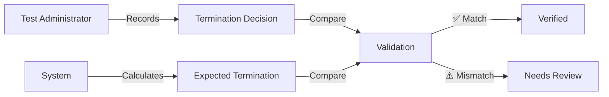

# User Guide: Checking System

**Version:** 1.0  
**Last Updated:** October 16, 2025  
**Target Users:** Research assistants, project managers, and data quality administrators

---

## Table of Contents

1. [Overview](#overview)
2. [Getting Started](#getting-started)
3. [Navigation Guide](#navigation-guide)
4. [Understanding Data Views](#understanding-data-views)
5. [Step-by-Step Workflows](#step-by-step-workflows)
6. [Status Indicators and Meanings](#status-indicators-and-meanings)
7. [Filters and Search](#filters-and-search)
8. [Data Export and Reporting](#data-export-and-reporting)
9. [Troubleshooting](#troubleshooting)
10. [FAQs](#faqs)
11. [Best Practices](#best-practices)

---

## Overview

The **4Set Checking System** is a web-based dashboard that monitors and validates assessment data uploaded to Jotform. It provides a comprehensive view of data completeness, quality, and accuracy across all assessment submissions.

### What It Does

The Checking System serves **two critical verification functions**:

#### A. Display Uploaded Data Accurately
- Shows exactly what test administrators recorded and uploaded
- Reflects manual decisions made during assessments
- Provides complete visibility into the database
- Serves as the "source of truth" for uploaded data

#### B. Validate Through Recalculation
- Recalculates termination rules based on actual responses
- Compares recorded decisions vs. system calculations
- Identifies data quality issues and recording errors
- Alerts administrators to inconsistencies

### Key Questions Answered

```
┌──────────────────────────────────────────┐
│  DATA COMPLETENESS                       │
│  • How many questions are unanswered?    │
│  • Which specific questions are missing? │
│  • Are there gaps in required fields?    │
└──────────────────────────────────────────┘
┌──────────────────────────────────────────┐
│  ADMINISTRATOR ACCURACY                  │
│  • Did they mark termination correctly?  │
│  • Do records match calculations?        │
│  • Are there any data entry errors?      │
└──────────────────────────────────────────┘
```

### Why This Matters

The Checking System recognizes that **termination values are RECORDS, not calculations**:



This dual approach provides:
1. What was officially recorded (human decision)
2. What the data says (system validation)
3. Ability to catch errors and data quality issues
4. Complete audit trail

---

## Getting Started

### Quick Start (5 Steps)

```
1. Open checking_system_home.html
   ↓
2. Enter system password
   ↓
3. Navigate hierarchy (District → Group → School → Class → Student)
   ↓
4. Review status indicators
   ↓
5. Export reports as needed
```

### System Access

#### Opening the Checking System

**Method 1: Direct File Access**
1. Navigate to repository folder
2. Open `checking_system_home.html` in Chrome/Edge
3. Enter system password when prompted

**Method 2: GitHub Pages** (if hosted)
1. Visit the GitHub Pages URL
2. Click "Checking System" from navigation
3. Enter password

#### System Password

The system password is required to:
- Decrypt credential bundles
- Access Jotform API
- View student data

**Security Features:**
- Password stored in encrypted `assets/credentials.enc`
- Credentials cached in browser session
- Auto-logout after inactivity
- No password saved in browser history

**If you don't have the password:**
- Contact your project administrator
- Password is set during system setup
- Different from individual user passwords

### First-Time Setup

No setup required! The Checking System works immediately after:
- ✅ System password is entered
- ✅ Jotform credentials are valid
- ✅ Browser has internet connection

---

## Navigation Guide

### System Hierarchy

The Checking System uses a hierarchical drill-down structure:

```
District (地區)
  └─ Group (組別)
      └─ School (學校)
          └─ Class (班級)
              └─ Student (學生)
```

### Homepage Layout

```
┌────────────────────────────────────────┐
│  4Set Checking System                  │
│  [System Status] [Cache Status]        │
├────────────────────────────────────────┤
│                                        │
│  HIERARCHY LEVELS:                     │
│                                        │
│  📊 District View                      │
│      View by district (Shatin, etc.)   │
│                                        │
│  👥 Group View                         │
│      View by project group (1-5)       │
│                                        │
│  🏫 School View                        │
│      View individual schools           │
│                                        │
│  👨‍🎓 Student Search                     │
│      Direct student lookup             │
│                                        │
└────────────────────────────────────────┘
```

### Navigation Breadcrumbs

At any level, breadcrumbs show your location:

```
Home > Shatin > Group 1 > School S023 > Class C-023-03 > Student C10207
  ↑      ↑        ↑          ↑             ↑               ↑
  Click to go back to any level
```

**Tips:**
- Click any breadcrumb to jump back to that level
- Use browser back button to go back one level
- Breadcrumbs show full navigation path

### Drill-Down Navigation

#### From District Level

```
┌─────────────────────────────────────┐
│  District: Shatin                   │
├─────────────────────────────────────┤
│  Group 1    [15 schools] →          │
│  Group 2    [12 schools] →          │
│  Group 3    [8 schools]  →          │
└─────────────────────────────────────┘
```

Click any group to see schools in that district + group.

#### From School Level

```
┌─────────────────────────────────────┐
│  School: S023 - ABC Primary School  │
├─────────────────────────────────────┤
│  Class C-023-01  [25 students] →    │
│  Class C-023-02  [24 students] →    │
│  Class C-023-03  [26 students] →    │
└─────────────────────────────────────┘
```

Click any class to see students in that class.

#### From Class Level

```
┌─────────────────────────────────────┐
│  Class: C-023-03                    │
├─────────────────────────────────────┤
│  C10207  陳小明  ✅ Complete         │
│  C10208  李小華  ⚠️  Partial         │
│  C10209  王小美  🔴 Incomplete       │
└─────────────────────────────────────┘
```

Click any student to see detailed assessment view.

---

## Understanding Data Views

### District View

**Purpose:** High-level overview of all districts

**What You See:**
```
┌──────────────┬──────────┬─────────┬──────────┐
│ District     │ Schools  │ Students│ Complete │
├──────────────┼──────────┼─────────┼──────────┤
│ Shatin       │ 35       │ 450     │ 85%      │
│ Sham Shui Po │ 28       │ 380     │ 78%      │
│ Kowloon City │ 22       │ 295     │ 92%      │
│ Tuen Mun     │ 18       │ 240     │ 81%      │
│ Yuen Long    │ 15       │ 198     │ 75%      │
│ Others       │ 12       │ 150     │ 70%      │
└──────────────┴──────────┴─────────┴──────────┘
```

**Key Metrics:**
- **Schools**: Number of schools in district
- **Students**: Total students across all schools
- **Complete**: Percentage with all tasks done

**Actions:**
- Click district name to drill down
- Sort by clicking column headers
- Filter by completion status

### Group View

**Purpose:** View schools grouped by project assignment

**What You See:**
```
┌────────┬──────────┬─────────┬──────────┐
│ Group  │ Schools  │ Students│ Complete │
├────────┼──────────┼─────────┼──────────┤
│ Group 1│ 25       │ 340     │ 88%      │
│ Group 2│ 20       │ 270     │ 82%      │
│ Group 3│ 18       │ 245     │ 79%      │
│ Group 4│ 15       │ 205     │ 85%      │
│ Group 5│ 12       │ 165     │ 76%      │
└────────┴──────────┴─────────┴──────────┘
```

**Key Metrics:**
- **Group**: Project group number (1-5)
- **Schools**: Schools in this group
- **Students**: Total student count
- **Complete**: Overall completion rate

**Actions:**
- Click group to see schools in that group
- Compare groups side-by-side
- Track group-level progress

### School View

**Purpose:** Detailed view of individual school

**What You See:**

```
┌─────────────────────────────────────────┐
│  School: S023                           │
│  Name: ABC Primary School               │
│  Chinese: ABC小學                       │
│  District: Shatin | Group: 1            │
├─────────────────────────────────────────┤
│  Summary Statistics                     │
│  • Total Students: 75                   │
│  • Completed: 62 (83%)                  │
│  • In Progress: 10 (13%)                │
│  • Not Started: 3 (4%)                  │
├─────────────────────────────────────────┤
│  Classes                                │
│  C-023-01  ████████░░ 80%              │
│  C-023-02  █████████░ 90%              │
│  C-023-03  ███████░░░ 70%              │
└─────────────────────────────────────────┘
```

**Key Information:**
- School identification (ID, names)
- Geographic/project grouping
- Overall completion statistics
- Class-by-class breakdown
- Progress bars for visual reference

**Actions:**
- Click class to drill down
- Export school report
- View completion trends
- Identify classes needing attention

### Class View

**Purpose:** See all students in a class

**What You See:**

```
┌────────┬─────────────┬────────────┬─────────────┐
│ Core ID│ Name        │ Tasks      │ Status      │
├────────┼─────────────┼────────────┼─────────────┤
│ C10207 │ 陳小明      │ 14/14 ✅   │ Complete    │
│ C10208 │ 李小華      │ 12/14 ⚠️   │ In Progress │
│ C10209 │ 王小美      │ 3/14  🔴   │ Incomplete  │
│ C10210 │ 張小強      │ 14/14 ✅   │ Complete    │
│ C10211 │ 林小芳      │ 0/14  ⭕   │ Not Started │
└────────┴─────────────┴────────────┴─────────────┘
```

**Key Information:**
- Student identification (Core ID, Name)
- Task completion count
- Overall status indicator
- Sortable columns

**Status Indicators:**
- ✅ **Green**: All tasks complete, no issues
- ⚠️ **Yellow**: Some tasks complete, needs review
- 🔴 **Red**: Incomplete, missing data
- ⭕ **Grey**: Not started

**Actions:**
- Click student to see detailed view
- Sort by any column
- Filter by status
- Export class report

### Student View (Most Detailed)

**Purpose:** Complete assessment details for one student

**Layout:**

```
┌─────────────────────────────────────────┐
│  Student: C10207 - 陳小明               │
│  School: S023 | Class: C-023-03         │
├─────────────────────────────────────────┤
│  TASK PROGRESS                          │
│                                         │
│  Set 1: Background Information          │
│  ✅ Background Survey      12/12 Q's    │
│                                         │
│  Set 2: Language Tasks                  │
│  ✅ ERV (English)          36/36 Q's    │
│  ⚠️  Chinese Word Reading  58/60 Q's    │
│  ✅ CM (Chinese)           22/22 Q's    │
│                                         │
│  Set 3: Cognitive Tasks                 │
│  ✅ SYM                    20/20 Q's    │
│  ✅ NONSYM                 20/20 Q's    │
│  🔴 Math Pattern           0/20  Q's    │
│                                         │
│  Set 4: Social-Emotional                │
│  ✅ TEC (Male)             15/15 Q's    │
│  ✅ Theory of Mind         4/4   Q's    │
│                                         │
│  [Expand each task for details]         │
└─────────────────────────────────────────┘
```

#### Task Details (Expanded)

Click any task to see question-level details:

```
┌─────────────────────────────────────────┐
│  Task: ERV (English Receptive Vocab)    │
├─────────────────────────────────────────┤
│  Progress: 36/36 questions               │
│  Status: ✅ Complete                     │
│                                         │
│  Termination Rules:                     │
│  Stage 1 (Q1-12):  ✅ Passed (8/12)    │
│  Stage 2 (Q13-24): ✅ Passed (6/12)    │
│  Stage 3 (Q25-36): ✅ Passed (7/12)    │
│                                         │
│  Questions View: [All] [Correct] [Wrong]│
│                                         │
│  Q1:  ✅ Correct                         │
│  Q2:  ✅ Correct                         │
│  Q3:  ❌ Incorrect                       │
│  Q4:  ✅ Correct                         │
│  ... (show/hide all questions)          │
│                                         │
│  Last Updated: 2025-09-04 14:07         │
└─────────────────────────────────────────┘
```

**Key Information:**
- Task name and description
- Question completion count
- Termination rule status
- Individual question results
- Timestamps

**Actions:**
- Toggle question visibility
- Filter to show only incorrect/missing
- View termination rule details
- Compare recorded vs calculated

---

## Step-by-Step Workflows

### Workflow 1: Check Overall Progress

**Goal:** Get a quick overview of project status

**Steps:**

1. **Open Checking System homepage**
   ```
   checking_system_home.html
   ```

2. **Enter system password**
   - Credentials cached for session
   - Re-enter if session expires

3. **Choose view type:**

   **Option A: By District**
   ```
   Click "District View"
   → See all districts
   → Identify districts with low completion
   ```

   **Option B: By Group**
   ```
   Click "Group View"
   → See all project groups
   → Compare group performance
   ```

4. **Review metrics:**
   - Look for completion rates < 80%
   - Identify outliers (very high/low)
   - Note districts/groups needing attention

5. **Export summary report** (optional)
   - Click "Export" button
   - Save as CSV/Excel
   - Share with stakeholders

**Time Required:** 2-5 minutes

### Workflow 2: Investigate Specific School

**Goal:** Deep dive into one school's data quality

**Steps:**

1. **Navigate to school:**
   ```
   Method A: Via District
   Home → District View → Select District → Select School
   
   Method B: Via Group
   Home → Group View → Select Group → Select School
   
   Method C: Direct Search
   Home → Search School ID or Name
   ```

2. **Review school summary:**
   - Overall completion percentage
   - Class-by-class breakdown
   - Identify problem classes

3. **Drill into low-performing class:**
   ```
   Click class with lowest completion
   ```

4. **Review student list:**
   - Sort by completion status
   - Identify incomplete students
   - Note patterns (all missing same task?)

5. **Check specific students:**
   ```
   Click student with incomplete status
   → Review task progress
   → Identify missing tasks
   ```

6. **Document findings:**
   - Note student IDs with issues
   - List specific missing tasks
   - Check for systematic problems

**Time Required:** 10-20 minutes per school

### Workflow 3: Validate Data Quality

**Goal:** Check for recording errors and data quality issues

**Steps:**

1. **Navigate to student detail view:**
   ```
   Home → ... → Class → Student
   ```

2. **Review termination rules:**
   ```
   For each task with termination rules:
   
   Check:
   ✓ Recorded value (what admin marked)
   ✓ Calculated value (what system computed)
   ✓ Match status (✅ or ⚠️)
   ```

3. **Identify mismatches:**

   **Example:**
   ```
   Task: ERV Stage 1
   Recorded:   "1" (Terminated)
   Calculated: "0" (Should Pass)
   Status:     ⚠️ MISMATCH - Review Needed
   ```

4. **Investigate mismatches:**
   - Expand question details
   - Count correct answers manually
   - Verify against threshold
   - Determine if recording error or system issue

5. **Take action:**

   **If recording error:**
   - Document for correction
   - Note student ID and task
   - Follow data correction procedure

   **If system calculation error:**
   - Document details
   - Report to technical team
   - Include screenshots

6. **Track validation progress:**
   - Mark students as "validated"
   - Document any issues found
   - Update tracking spreadsheet

**Time Required:** 5-10 minutes per student

### Workflow 4: Generate Reports

**Goal:** Create reports for stakeholders

**Steps:**

1. **Choose report level:**
   - District report
   - School report
   - Class report
   - Student report

2. **Navigate to desired level:**
   ```
   Example for School Report:
   Home → District → Group → School
   ```

3. **Review data on screen first:**
   - Verify data looks correct
   - Check for obvious errors
   - Ensure filters applied correctly

4. **Click "Export" button:**
   ```
   Options:
   - CSV (for Excel/analysis)
   - PDF (for printing/sharing)
   - JSON (for technical use)
   ```

5. **Configure export options:**
   - Include/exclude specific columns
   - Filter by status
   - Date range selection

6. **Save file:**
   - Choose descriptive filename
   - Include date in filename
   - Save to shared drive if needed

7. **Verify export:**
   - Open file to confirm contents
   - Check formatting
   - Verify data accuracy

**Time Required:** 5-10 minutes per report

### Workflow 5: Daily Monitoring

**Goal:** Daily check for new submissions and issues

**Steps:**

1. **Open Checking System**

2. **Check cache status:**
   ```
   Top right corner shows:
   "Cache updated: 2 minutes ago"
   ```

   **If outdated:**
   - Click "Refresh Cache"
   - Wait for update to complete

3. **Review recent submissions:**
   ```
   Filter by: "Last 24 hours"
   ```

4. **Check for immediate issues:**
   - Any unsorted files?
   - Any validation failures?
   - Any schools at 0%?

5. **Spot check random samples:**
   - Pick 3-5 random schools
   - Review 1-2 students each
   - Verify data quality

6. **Document any issues:**
   - Note in daily log
   - Escalate urgent problems
   - Track for weekly meeting

**Time Required:** 15-20 minutes daily

---

## Status Indicators and Meanings

### Task Status Colors

The Checking System uses a color-coded status system:

#### ✅ Green - Complete & Verified

**Meaning:**
- All questions answered
- Termination rules verified (if applicable)
- No data quality issues detected
- Recorded values match calculations

**What to do:** Nothing - task is complete and accurate

#### ⚠️ Yellow - Complete but Needs Review

**Meaning:**
- All questions answered BUT
- Termination rule mismatch detected
- Recorded decision ≠ calculated result
- Possible recording error

**What to do:**
1. Expand task details
2. Review termination rule comparison
3. Manually verify correctness
4. Document if error found

**Example:**
```
Task: CM Stage 1
Recorded:   "0" (Passed)
Calculated: "1" (Should Terminate)
Action: Verify which is correct
```

#### 🔴 Red - Incomplete

**Meaning:**
- Missing questions (unanswered)
- Below minimum required
- Task not fully completed

**What to do:**
1. Check how many questions missing
2. Determine if acceptable (early termination OK)
3. If not terminated: follow up with administrator
4. If terminated correctly: may be OK

**Example:**
```
Task: Math Pattern
Answered: 8/20
Expected: ≥20 (unless terminated)
Action: Check if termination triggered
```

#### ⭕ Grey - Not Started

**Meaning:**
- Task not attempted
- Zero questions answered
- No data submitted

**What to do:**
1. Verify task was required for this student
2. Check if gender-conditional (TEC Male/Female)
3. Follow up if task should have been done
4. Document if intentionally skipped

### Termination Rule Indicators

Each task with termination rules shows stage-level status:

```
Stage 1 (Q1-12):   ✅ Passed (7/12 correct, need ≥5)
Stage 2 (Q13-24):  ✅ Passed (6/12 correct, need ≥5)
Stage 3 (Q25-36):  🔴 Failed (3/12 correct, need ≥5)
                   ⏹️ Terminated - Q37-60 not shown
```

**Stage Indicators:**
- ✅ **Green**: Threshold met, continued
- 🔴 **Red**: Threshold not met, terminated
- ⏹️ **Stopped**: Termination triggered, later questions skipped

### Completion Progress Bars

Visual bars show completion percentage:

```
████████████████████ 100%  Complete
████████████████░░░░  80%  Nearly done
████████░░░░░░░░░░░░  40%  In progress
████░░░░░░░░░░░░░░░░  20%  Just started
░░░░░░░░░░░░░░░░░░░░   0%  Not started
```

**Color coding:**
- Green: 80-100%
- Yellow: 50-79%
- Orange: 20-49%
- Red: 0-19%

---

## Filters and Search

### Filter Options

#### By Status

```
┌────────────────┐
│ Status Filter  │
├────────────────┤
│ ☑ Complete     │
│ ☑ In Progress  │
│ ☑ Incomplete   │
│ ☐ Not Started  │
└────────────────┘
```

**Use cases:**
- Hide completed students (focus on issues)
- Show only incomplete (action items)
- View all for comprehensive review

#### By Date Range

```
From: [2025-09-01]  To: [2025-09-30]
```

**Use cases:**
- View submissions from specific period
- Compare this month vs last month
- Generate period-specific reports

#### By School/Class

```
School: [S023 - ABC Primary]
Class:  [C-023-03]
```

**Use cases:**
- Focus on specific school/class
- Compare classes within school
- Track specific cohort

#### By Task

```
Task: [ERV] [CM] [CWR] [All]
```

**Use cases:**
- Check completion of specific task
- Identify systematic issues with one task
- Focus data quality review

### Search Functionality

#### Search by Student ID

```
Search: [C10207]  [Search]
```

**Features:**
- Instant search as you type
- Fuzzy matching (partial IDs)
- Auto-suggest from database

**Example:**
```
Type: "102"
Results:
  C10207 - 陳小明
  C10208 - 李小華
  C10209 - 王小美
```

#### Search by Student Name

```
Search: [陳小明]  [Search]
```

**Features:**
- Chinese and English names
- Partial name matching
- Case-insensitive

#### Search by School

```
Search: [ABC Primary]  [Search]
```

**Features:**
- School ID or name
- Chinese or English
- Shows all students in school

### Advanced Filters

#### Combined Filters

```
Status: Incomplete
Task: ERV
Date: Last 30 days
School: S023
```

**Result:** All incomplete ERV tasks for School S023 in last 30 days

#### Saved Filter Sets

```
My Filters:
- Weekly Review (Incomplete + Last 7 days)
- Quality Check (Yellow status + All tasks)
- Not Started (Grey status + All schools)
```

**Save frequently used filter combinations for quick access**

---

## Data Export and Reporting

### Export Formats

#### CSV Export

**Best for:**
- Excel analysis
- Data manipulation
- Creating custom reports
- Sharing with stakeholders

**Contains:**
- All visible columns
- Filtered data only
- Formatted for Excel
- UTF-8 with BOM (Chinese characters)

**Example filename:**
```
school_S023_export_2025-10-16.csv
```

#### PDF Export

**Best for:**
- Printing
- Official reports
- Presentations
- Archival

**Contains:**
- Formatted tables
- Charts and graphs
- Summary statistics
- Header with date/time

**Example filename:**
```
class_C-023-03_report_2025-10-16.pdf
```

#### JSON Export

**Best for:**
- Technical analysis
- Integration with other systems
- Backup purposes
- API consumption

**Contains:**
- Raw data structure
- All metadata
- Nested relationships
- Timestamps

### Report Types

#### Summary Reports

**District Summary:**
```
District: Shatin
Total Schools: 35
Total Students: 450
Completion Rate: 85%
Issues Identified: 12
```

**School Summary:**
```
School: S023 - ABC Primary
Classes: 3
Students: 75
Tasks per Student: 14
Average Completion: 83%
```

#### Detailed Reports

**Class Report:**
- Student list with status
- Task completion matrix
- Issue summary
- Recommendations

**Student Report:**
- Complete task breakdown
- Question-level details
- Termination rule validation
- Timeline of submissions

#### Progress Reports

**Weekly Progress:**
- New submissions this week
- Completion rate change
- Issues resolved
- Outstanding items

**Monthly Summary:**
- Total submissions this month
- By school/district breakdown
- Quality metrics
- Trends and patterns

### Scheduled Reports

#### Daily Digest

**Automatically generated:**
- Each morning at 8 AM
- Yesterday's submissions
- New issues detected
- Action items

**Delivered via:**
- Email to stakeholders
- Saved to shared drive
- Dashboard notification

#### Weekly Review

**Automatically generated:**
- Each Monday
- Previous week summary
- Completion trends
- Quality metrics
- Comparison to previous week

---

## Troubleshooting

### Display Issues

#### "No data loading"

**Symptoms:**
- Blank screens
- "Loading..." message persists
- Tables show no rows

**Possible Causes:**
1. Network connection lost
2. Jotform API error
3. Invalid credentials
4. Cache expired

**Solutions:**
1. Check internet connection
2. Refresh page (Ctrl+R)
3. Clear cache and reload
4. Re-enter system password
5. Check browser console (F12) for errors

#### "Incorrect data showing"

**Symptoms:**
- Wrong student names
- Outdated completion counts
- Missing recent submissions

**Possible Causes:**
1. Cache not updated
2. Browser using old data
3. OneDrive sync delay

**Solutions:**
1. Click "Refresh Cache" button
2. Hard refresh (Ctrl+Shift+R)
3. Clear browser cache
4. Wait 5-10 minutes for sync
5. Verify data in Jotform directly

### Performance Issues

#### "System very slow"

**Symptoms:**
- Pages take long to load
- Clicking has delay
- Browser feels sluggish

**Possible Causes:**
1. Large dataset (many students)
2. Multiple filters applied
3. Browser memory full
4. Network latency

**Solutions:**
1. Close other browser tabs
2. Simplify filters
3. View smaller date ranges
4. Restart browser
5. Clear browser cache
6. Use faster internet connection

#### "Exports timing out"

**Symptoms:**
- Export button doesn't respond
- Download never starts
- Browser shows error

**Possible Causes:**
1. Too much data selected
2. Browser memory limit
3. Popup blocker active

**Solutions:**
1. Export smaller date ranges
2. Filter to reduce data
3. Allow popups for this site
4. Try different export format (CSV instead of PDF)
5. Split into multiple exports

### Data Quality Issues

#### "Termination rule mismatch"

**Symptoms:**
- Yellow ⚠️ status showing
- Recorded ≠ Calculated
- "Review needed" message

**Investigation Steps:**
1. Expand task details
2. Count correct answers manually
3. Verify threshold (ERV: ≥5, CM: ≥4)
4. Check if questions marked correctly
5. Review PDF if available

**Possible Causes:**
1. Administrator counting error
2. Ambiguous answer (marked wrong but should be correct)
3. System calculation error
4. Missing question data

**Resolution:**
1. Document the discrepancy
2. Review with administrator
3. Determine correct value
4. Follow data correction procedure
5. Report if system bug

#### "Missing data"

**Symptoms:**
- Grey ⭕ or Red 🔴 status
- Low question count
- Gaps in task completion

**Investigation Steps:**
1. Check if task required
2. Verify not gender-conditional skip
3. Check termination rules (valid stop?)
4. Review upload logs
5. Verify PDF was processed

**Possible Causes:**
1. Assessment not completed
2. PDF upload failed
3. Processor agent error
4. Early termination (valid)

**Resolution:**
1. Check `filed/Unsorted/` for failed PDFs
2. Review processor logs
3. Re-upload PDF if needed
4. Document if intentionally skipped

---

## FAQs

### General Questions

**Q: How often does data update?**  
A: Real-time for Jotform API calls. Cache updates every 5 minutes by default. Click "Refresh Cache" for immediate update.

**Q: Can I edit data in the Checking System?**  
A: No. The Checking System is read-only. Data correction must be done in Jotform or by re-processing PDFs.

**Q: Who can access the Checking System?**  
A: Anyone with the system password. Access should be limited to authorized personnel.

**Q: Is my browser history tracked?**  
A: No personal tracking. Only anonymous usage statistics (page views, errors) if analytics enabled.

### Technical Questions

**Q: What browsers are supported?**  
A: Chrome 90+, Edge 90+, Firefox 88+. Safari 14+ (limited support). Mobile browsers: iOS Safari 14+, Chrome Android 90+.

**Q: Does it work offline?**  
A: Partially. Cached data viewable offline. New data requires internet connection for Jotform API calls.

**Q: Where is data stored?**  
A: Temporarily in browser cache (IndexedDB/LocalStorage). Permanently in Jotform database. No data stored on intermediate servers.

**Q: How secure is the system?**  
A: 
- HTTPS encryption for all API calls
- Credentials encrypted in transit
- Session timeout after 30 minutes
- No data sent to third parties
- Password required for access

### Data Questions

**Q: Why do termination rules sometimes mismatch?**  
A: 
1. Counting errors by administrator
2. Ambiguous answers (marked wrong but debatable)
3. Missing data (questions skipped)
4. System calculation logic difference

Always manually verify when mismatch detected.

**Q: What does "Not Started" mean?**  
A: Zero questions answered for that task. Either not attempted, or PDF not uploaded yet.

**Q: Can I see who uploaded each assessment?**  
A: Yes, if metadata present. Check `computerno` field in student detail view. Shows PC number of uploader.

**Q: How long does data retention last?**  
A: Forever (in Jotform). Local cache cleared after 30 days or when manually cleared. Exports saved indefinitely.

---

## Best Practices

### Daily Monitoring

1. **Start of Day Routine (15 min)**
   - Open Checking System
   - Refresh cache
   - Review yesterday's submissions
   - Check for errors/issues
   - Prioritize action items

2. **Random Sampling**
   - Pick 5 random students daily
   - Review data quality
   - Verify termination rules
   - Document any issues

3. **Issue Tracking**
   - Maintain log of issues found
   - Track resolution progress
   - Follow up on pending items
   - Report patterns to team

### Weekly Review

1. **Progress Assessment**
   - Generate weekly summary report
   - Compare to previous week
   - Identify trends
   - Highlight achievements

2. **Quality Audit**
   - Review 10-15 students in detail
   - Check termination rule accuracy
   - Verify data completeness
   - Document quality metrics

3. **School Follow-ups**
   - Contact schools with < 50% completion
   - Provide support for issues
   - Answer questions
   - Schedule check-ins

### Monthly Reporting

1. **Comprehensive Reports**
   - District-level summaries
   - School-by-school breakdown
   - Quality metrics dashboard
   - Issue resolution tracking

2. **Stakeholder Updates**
   - Email reports to management
   - Highlight key findings
   - Provide recommendations
   - Track action items

3. **System Health**
   - Review performance metrics
   - Check for technical issues
   - Update documentation
   - Plan improvements

### Data Quality

1. **Validation Procedures**
   - Always check termination mismatches
   - Manually verify ambiguous cases
   - Document all discrepancies
   - Follow correction procedures

2. **Systematic Checks**
   - Look for patterns in errors
   - Identify problematic tasks
   - Train administrators on common issues
   - Improve data collection procedures

3. **Continuous Improvement**
   - Track error rates over time
   - Identify root causes
   - Implement preventive measures
   - Share best practices

### Communication

1. **With Administrators**
   - Provide clear, specific feedback
   - Include screenshots
   - Explain issues simply
   - Offer solutions

2. **With Management**
   - Use visual reports (charts, graphs)
   - Focus on key metrics
   - Highlight risks and concerns
   - Provide actionable recommendations

3. **With Technical Team**
   - Document technical issues thoroughly
   - Include error messages
   - Provide steps to reproduce
   - Suggest potential fixes

---

## Quick Reference

### Status Indicators

```
✅ Green    = Complete & Verified
⚠️ Yellow   = Needs Review (Mismatch)
🔴 Red      = Incomplete (Missing Data)
⭕ Grey     = Not Started
```

### Navigation Path

```
District → Group → School → Class → Student
   ↑________↑_______↑______↑_____↑
   Click any level in breadcrumb to go back
```

### Common Tasks

```
Check Progress:    District View → Review %
Find Student:      Search → Enter ID/Name
Export Report:     Navigate → Export Button
Validate Data:     Student View → Check ⚠️
Refresh Data:      Top Right → Refresh Cache
```

### Keyboard Shortcuts

```
Ctrl+R          Refresh page
Ctrl+Shift+R    Hard refresh (clear cache)
Ctrl+F          Search on page
F12             Open developer console
Esc             Close modals
```

### Support Contacts

```
Technical Issues:   [Technical Team Email]
Data Questions:     [Data Team Email]
System Access:      [Administrator Email]
General Inquiries:  [Project Email]
```

---

## Qualtrics TGMD Data Integration

**Feature Status:** ✅ Implemented (2025-10-23)

### Overview

The Checking System now supports fetching TGMD (Test of Gross Motor Development) assessment data directly from Qualtrics surveys. This dual-source integration allows combining web-based TGMD assessments from Qualtrics with PDF-based assessments from JotForm.

### What Is TGMD?

TGMD assessments evaluate gross motor skills through:
- Hopping, jumping, sliding movements
- Dribbling, catching, throwing activities
- Hand and leg preference tracking

These assessments are administered via Qualtrics web surveys, making data entry more efficient and accurate.

### How to Sync Qualtrics Data

#### Step 1: Access the Home Page
1. Navigate to the Checking System home page
2. Enter the system password to decrypt credentials
3. Verify that the status pills show "Data Decrypted"

#### Step 2: Initiate Qualtrics Sync
1. Locate the **"Sync with Qualtrics"** button (purple gradient, top right of status section)
2. Click the button to open the sync modal


#### Step 3: Start the Sync Process
1. Review the sync information in the modal
2. Click **"Sync with Qualtrics"** to begin
3. Watch the progress bar as the system:
   - Starts Qualtrics export (5-15%)
   - Polls export progress (15-80%)
   - Downloads responses (80-85%)
   - Transforms data (85-90%)
   - Merges with JotForm (90-95%)
   - Saves to cache (95-100%)

**Typical Duration:** 30-60 seconds for 200 TGMD responses

#### Step 4: Review Results
When sync completes, the modal displays:
- **Total Records:** Combined JotForm + Qualtrics count
- **TGMD from Qualtrics:** Count of students with Qualtrics TGMD data
- **TGMD from JotForm:** Count of students with JotForm-only TGMD data
- **Conflicts Detected:** Number of records where values differ (Qualtrics takes priority)

Example Results:
```
✅ Sync Complete

Total records: 544
TGMD from Qualtrics: 198
TGMD from JotForm: 42
Conflicts detected: 3
```

### Viewing TGMD Data Source

After syncing, student detail pages display data source badges:

#### Qualtrics Badge (Purple)

- Appears next to TGMD task title
- Indicates TGMD data came from Qualtrics survey
- Purple gradient with database icon

#### JotForm Badge (Pink)

- Appears next to TGMD task title
- Indicates TGMD data came from JotForm PDF upload
- Pink gradient with file icon

### Data Precedence Rules

When both JotForm and Qualtrics have TGMD data for the same student:

1. **Qualtrics Takes Priority:** TGMD field values from Qualtrics are used
2. **Conflicts Are Logged:** Differences are recorded but not displayed to users
3. **JotForm Preserved:** Non-TGMD data always comes from JotForm
4. **Metadata Tracked:** System tracks data source and merge timestamp

### Troubleshooting

#### "Failed to Fetch Qualtrics Data"
**Possible Causes:**
- Missing or invalid Qualtrics credentials
- Network connectivity issues
- Qualtrics API rate limiting

**Solution:**
- Check with system administrator to verify credentials
- Try again after a few minutes
- System will continue with JotForm-only data

#### "Export Timeout After 2 Minutes"
**Cause:** Qualtrics export took longer than expected

**Solution:**
- Try again during off-peak hours
- Contact administrator if problem persists
- Large surveys may require longer timeout

#### "No TGMD Data Source Badge"
**Possible Causes:**
- Student has not completed TGMD assessment
- Sync has not been run since TGMD completion
- TGMD data is missing in both sources

**Solution:**
- Run Qualtrics sync to update data
- Verify student completed TGMD assessment
- Check JotForm for manual TGMD entries

### Best Practices

1. **Regular Syncing:**
   - Sync daily or after major TGMD assessment sessions
   - Ensures most recent data is available

2. **Verify After Import:**
   - Check merge statistics after each sync
   - Review conflict counts (should be minimal)
   - Investigate unexpected conflict patterns

3. **Cache Management:**
   - System automatically caches merged data
   - Cache expires after 1 hour
   - Manual refresh available via status pill

4. **Data Quality:**
   - Qualtrics source is preferred for TGMD (web-based entry)
   - JotForm serves as backup for manual corrections
   - Source badges help track data origin

### Technical Details

**Credentials Required:**
- `qualtricsApiKey`: Qualtrics API authentication token
- `qualtricsDatacenter`: Data center region (e.g., "au1")
- `qualtricsSurveyId`: TGMD survey identifier

**Field Mapping:**
- 45 TGMD fields mapped in `assets/qualtrics-mapping.json`
- Includes Hand/Leg preference, movement criteria, trial data
- Matrix question patterns automatically handled

**Cache Structure:**
- Merged data stored in `jotform_global_cache`
- Raw Qualtrics responses in `qualtrics_cache`
- Persists across browser sessions via IndexedDB

### FAQs

**Q: How often should I sync Qualtrics data?**
A: Daily, or after major assessment sessions. Data is cached for 1 hour.

**Q: What happens if Qualtrics is unavailable?**
A: System continues with JotForm-only data. TGMD may be incomplete but other tasks are unaffected.

**Q: Can I see which responses conflicted?**
A: Conflicts are logged in browser console. Contact administrator for detailed conflict report.

**Q: Does this replace JotForm uploads?**
A: No. JotForm remains the primary data source for all non-TGMD tasks and serves as TGMD backup.

**Q: How long is Qualtrics data cached?**
A: Merged data cache expires after 1 hour. Click status pill to refresh manually.

---

**End of User Guide: Checking System**

*For questions, feedback, or support, please contact the project team or refer to the technical documentation in the PRDs folder.*
